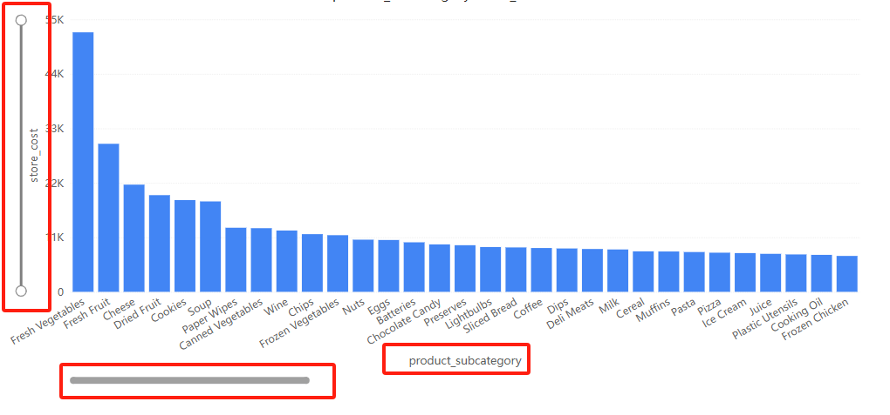
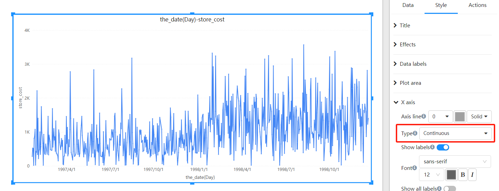
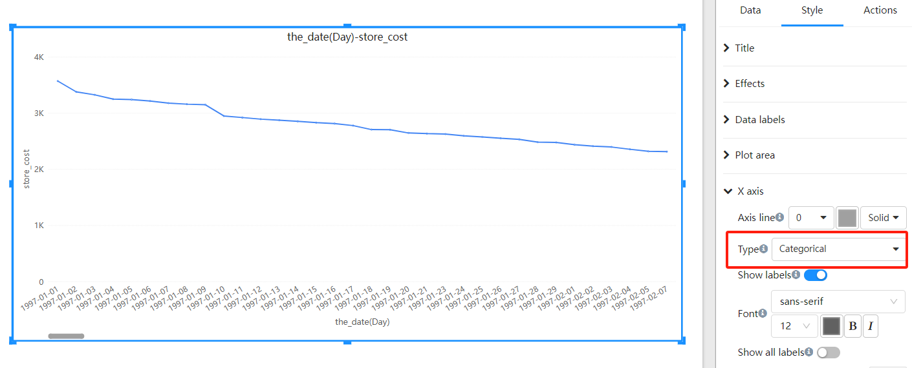

   # v6.06 更新:

   1. 坐标图优化：支持滚动条、缩放和自动布局（图例、轴文字、轴名称、网格等）

      

   2. 在X轴上增加了“连续”和“类别”类型。“连续”适用于数值或时间序列数据，而“类别”适用于类别数据。

      

      

   3. 负值显示优化：适用于瀑布图、比例堆积图等。

      

   4. 图表工具提示优化

   5. 表格分页查询性能优化

   6. 增加系统参数：#{system.username}, #{system.role}, #{system.roles_array}, #{system.locale} 等。

   7. 过滤空值的SQL优化

   8. 指标过滤性能优化

   9. 多事实表排序的错误和性能优化

   10. 许可证更新

   11. 其他优化和错误修复