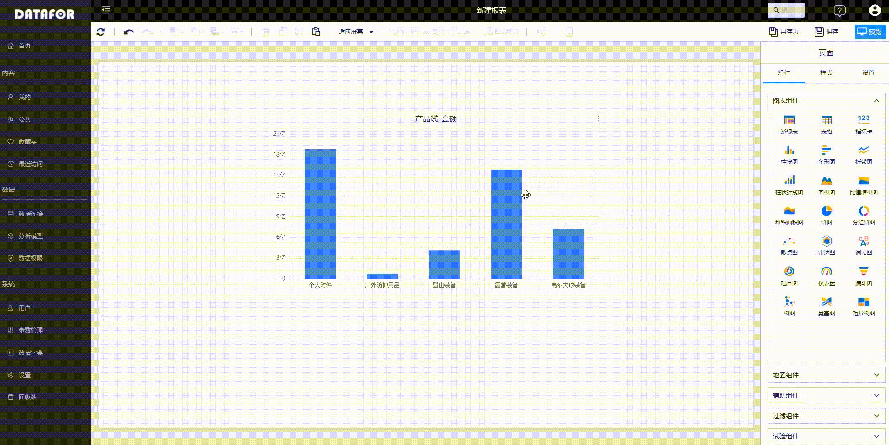

# 制作页面的基本操作

Datafor 提供了灵活和强大的仪表盘和报表制作能力，允许用户在画布上管理和调整可视化组件。本文将介绍这些关键功能，包括添加、删除、调整大小、移动、对齐、分布、图层调整、类型切换、复制等。

## 添加和删除组件

### 添加组件

- 从右侧的组件对象面板中选择一个组件。
- 点击所需的组件类型，将其添加到报表画布中。
- 从字段面板拖动字段到组件的数值、轴、图例等相应的区域中，填充数据。

### 删除组件

- 点击要删除的组件进行选择，或者按Ctrl键+鼠标点击组件或者鼠标在画布上通过拖画方式选中多个组件。
- 按键盘上的 Delete 键，或点击工具条上的 "删除” 按钮。

## 调整组件大小

**调整句柄**：

- 选择组件。
- 拖动角或边缘的调整句柄，调整组件的大小。

**输入组件宽度和高度值**

- 在工具栏上的宽和高输入框中直接输入组件的宽度值和高度值。这同时调整多个组件的大小时，这种方法非常有效。

## 移动组件

**拖放**：

- 选中一个或多个组件。
- 拖动组件到画布上的期望位置。

## 对齐和分布组件

**对齐**：

- 按住 Ctrl 键并点击每个组件，选择多个组件。
- 在工具条上，选择”对齐“ 设置按钮，在下拉菜单选择对齐方式。

**分布**：

- 选择多个组件。
- 在工具条上，选择”分布“，在下拉菜单选择水平或垂直分布。

## 图层调整

- 右键点击组件。
- 在工具栏，选择”图层“设置按钮，在下拉菜单调整组件的层次位置。

## 复制组件

支持复制/剪切、粘贴单个组件或多个组件，支持跨页面复制/剪切和粘贴。

- 选中一个或多个组件，通过工具栏上的复制、剪切、粘贴按钮进行复制、剪切、粘贴操作。
- 选中一个或多个组，通过快捷键Ctrl+C、Ctrl+X、Ctrl+V进行复制、剪切、粘贴操作

## 组件类型的切换

在设计过程中，组件类型可以切换，切换后的组件使用原来组件的数据模型。

