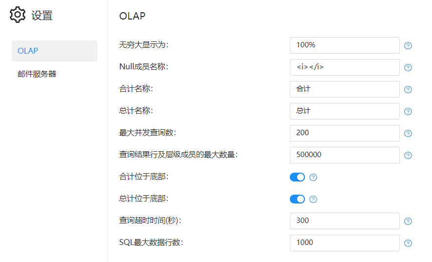

# OLAP设置

> **联机分析处理**(On Line Analytical Proccessing，简称OLAP) 概念最早由关系数据库之父E.F.Codd于1993年提出。OLAP应用是目前数据仓库上的重要应用之一，是决策分析的关键。

Datafor内置了一个OLAP引擎，根据项目的不同场景，可以配置OLAP。

| 配置项                       | 说明 |
| ---------------------------- | ---- |
| 无穷大显示为                 |      |
| Null成员名称                 |      |
| 最大并发查询数               |      |
| 查询结果行及层级成员最大数量 |      |
| 查询超时时间（秒）           |      |
| SQL最大返回数据行            |      |
|                              |      |
|                              |      |
|                              |      |

