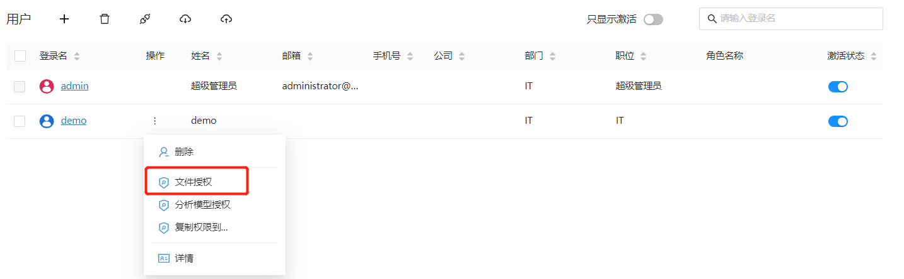
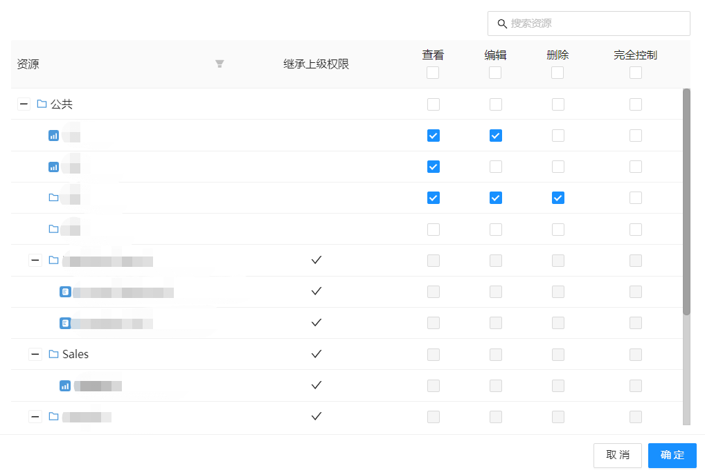
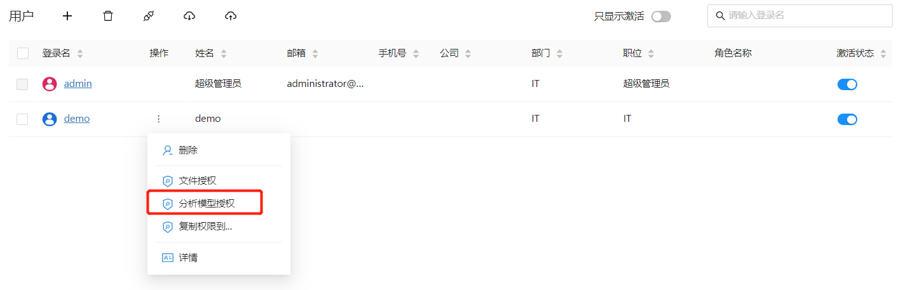
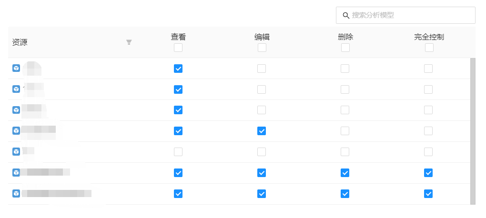
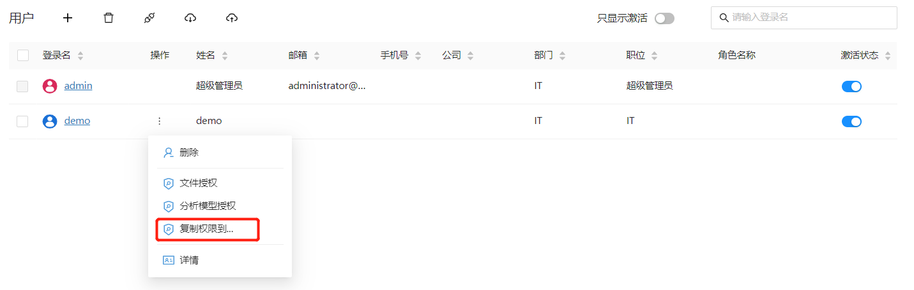
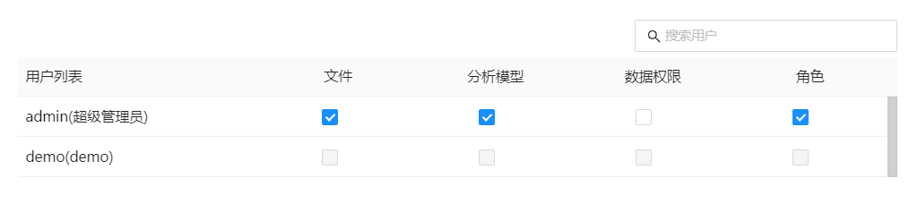

# 为用户或角色授权

通常新增用户或角色，需要进行授权。

## 文件夹和文件

1. 进入用户管理界面选择”文件授权“菜单项

   

2. 设置文件和目录的访问权限

   

   | 权限         | 描述                                   |
| ------------ | -------------------------------------- |
| 查看         | 允许查看内容                           |
| 编辑         | 允许查看、编辑内容                     |
| 删除         | 允许查看、编辑和删除内容               |
| 完全控制     | 允许查看、编辑、删除，并且允许设置权限 |

## 数据源

## 分析模型

1. 进入用户管理界面选择”文件授权“菜单项

   

2. 设置分析模型访问权限

   

   | 权限         | 描述                                   |
| ------------ | -------------------------------------- |
| 查看         | 允许查看内容                           |
| 编辑         | 允许查看、编辑内容                     |
| 删除         | 允许查看、编辑和删除内容               |
| 完全控制     | 允许查看、编辑、删除，并且允许设置权限 |

## 将权限设置复制给其它用户或角色

1. 进入用户管理界面选择”复制权限到...”菜单项

   

2. 选择“复制内容”和“复制对象”

   

