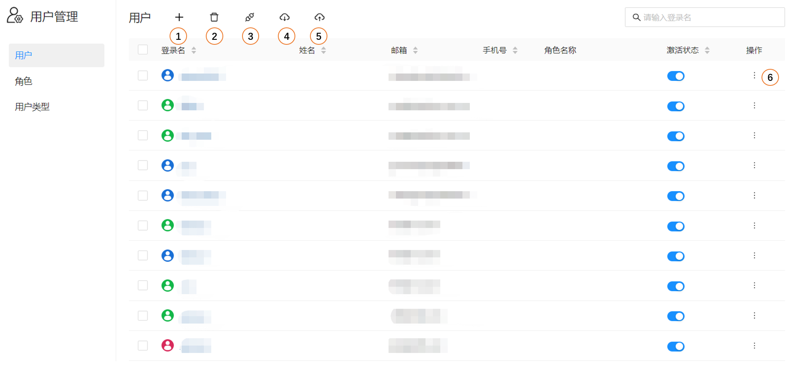
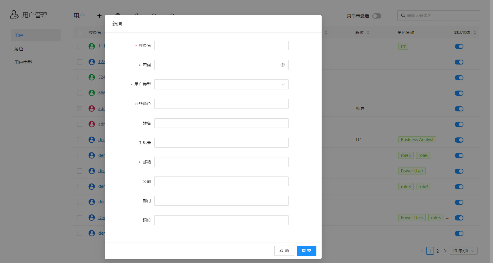
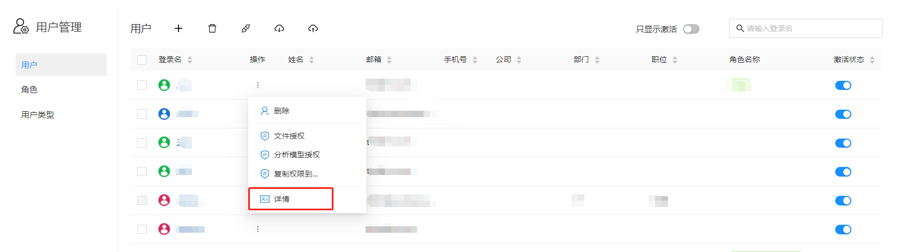
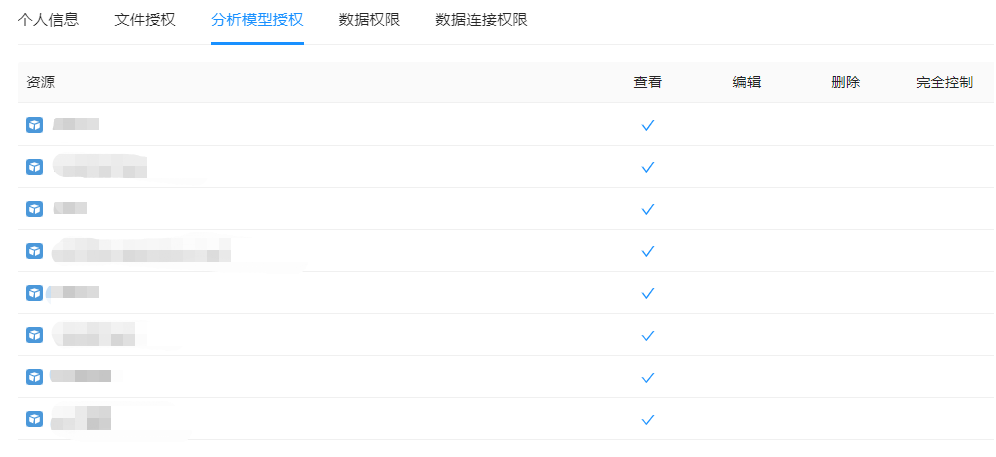

# 用户管理

管理员或超级管理员用户登录系统，点击导航菜单“用户”。选择“用户”子菜单进行用户管理。

1. **新增**：创建新用户
2. **批量删除**：删除用户
3. **批量激活**：激活用户
4. **导出**：将用户信息导出到Excel文件
5. **导入**：从Excel文件将用户导入到系统
6. **搜索**：搜索用户
7. **状态开关**：激活状态设置
8. **操作菜单**：删除、目录文件权限、复制权限到...、分析模型权限、设置角色、查看详情

## 新增用户

系统提供2种新增用户方式：

1. 点击“新增”按钮，手动添加用户信息。

   

​		

2. 点击“导入”按钮，从Excel文件批量导入用户信息。

## 查看用户详细数据

点击操作菜单的“详情”菜单

用户详情界面可以查看该用户的个人信息和拥有的各种系统权限，包括：文件和目录权限、分析模型权限、数据权限、数据连接权限等信息。

