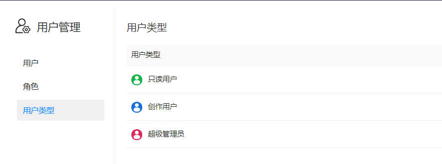

# 用户类型

Datafor中有四种类型的用户，创建用户必须指定一种用户类型。

- **只读用户**：只能查看报表。
- **创作用户**：可以创建数据连接、分析模型和分析报表和其它授权给他的工具。
- **管理员用户**：除了拥有创作用户的权限，还拥有系统管理、用户管理等权限。
- **超级管理员**：除了拥有管理员用户所拥有的权限，拥有“公共”文件夹下的所有文件的管理权限和所有数据源、分析模型的管理权限。

除了“超级管理员”，其它用户类型都可以单独进行授权，包括：数据连接权限、分析模型权限、文件和目录权限。

