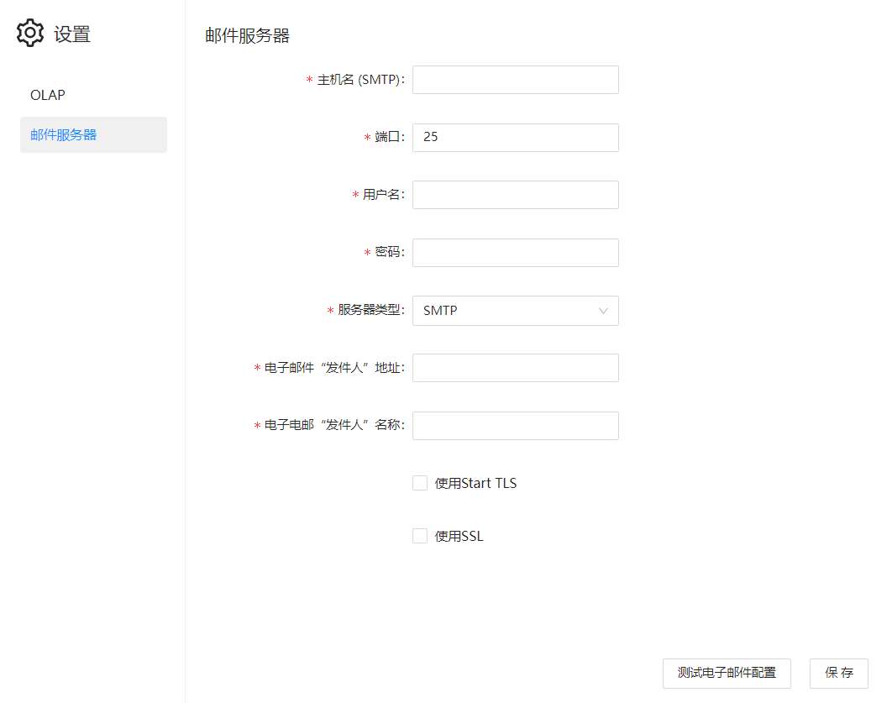

# 配置邮件服务器

Datafor支持发送邮件。因此在系统设置中需要配置邮件服务器。

|  邮箱设置项   |                           说明                           |
| :-----------: | :------------------------------------------------------: |
| 邮邮件服务器  | 输入邮件服务器，格式为SMTP.邮箱后缀。例如smtp.ym.163.com |
|     端口      |       设置邮件服务的端口和加密方式 默认使用25端口        |
|  服务器类型   |                    选择smtp或者smtps                     |
|  发件人地址   |                    填写发件人邮箱地址                    |
|     密码      |                      发件人邮箱密码                      |
|  发件人名称   |                     邮箱发件人的名称                     |
| 使用Start TLS |                      使用 TLS 协议                       |
|    使用SSL    |                 SMTP 服务器支持 SSL 加密                 |
