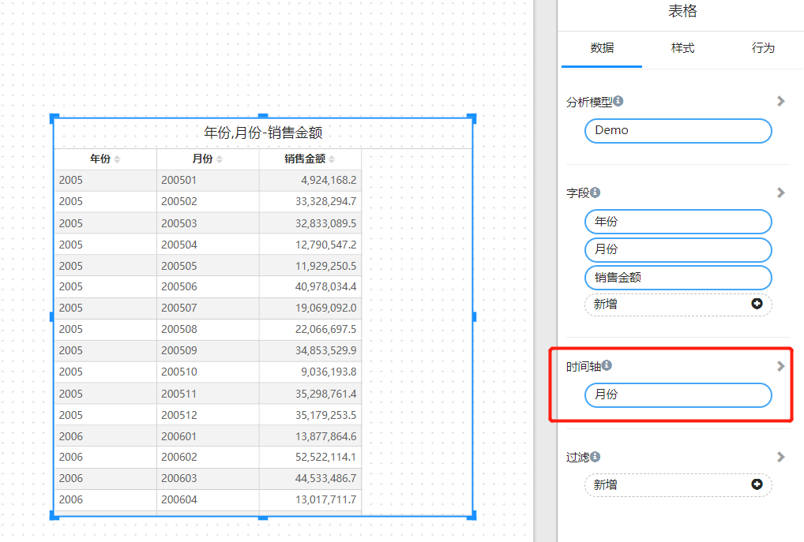
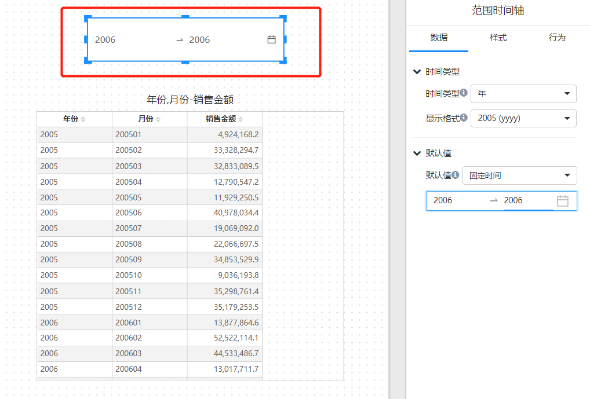

# 时间轴

## 图表组件数据面板上的“时间轴"有什么用？

“时间轴” 功能用于通过**一个** “时间轴筛选” 组件来过滤模型中的**多个**“时间字段”。

例如，如果模型中包含“销售日期”、“采购日期”和“进货日期”等字段，或者有不同时间粒度的指标，如“销售预算金额”按“年”粒度显示，而“销售金额”按“天”粒度显示，您可以使用“时间轴”来对这些不同组件进行统一的时间筛选。

通过“时间轴”，您可以在报表中一致地应用时间过滤，确保对时间数据的过滤在所有相关组件中同步进行。

## 时间轴的工作原理

时间轴筛选器将选定的时间范围应用于图表组件的时间轴字段，从而进行数据筛选。

例如：

- **图表A**的时间轴字段为“销售月份”。
- **图表B**的时间轴字段为“采购年份”。

当时间轴筛选器选择的时间范围为“1998年”时：

- **图表A**的查询条件将为：“销售月份”在1998年1月到1998年12月之间。
- **图表B**的查询条件将为：“采购年份” 等于 “1998年”。

**注意**：时间轴筛选器可以用于筛选与其粒度相同或更细的时间字段。例如，年份筛选器可以筛选年、月、天级别的字段，而月份筛选器可以筛选月、天级别的字段。

## 如何使用”时间轴“？

1. 在图表组件设置”**时间轴**“字段

   

2. 报表页面上添加 ”时间轴“ 或 “范围时间轴” 筛选组件

   

3. 将筛选组件和图表组件建立订阅关系

   

## 常见问题

1. **"时间轴"或“时间轴范围”筛选器是否需要绑定时间字段？**

   不需要。时间轴筛选器可以独立于具体的时间字段进行设置和使用。

2. **在什么情况下使用时间轴筛选器？**

   当报表中存在多个时间字段需要通过同一时间筛选器进行筛选，或者需要对不同粒度的时间字段应用统一的时间筛选器时，可以使用时间轴筛选器。

3. **如果时间轴筛选器设置为“年份”，是否可以应用于时间轴字段为“天”的图表？**

   可以。时间轴筛选器的粗粒度（如年份）可以用于筛选更细粒度（如天）的时间字段。然而，从性能角度来看，使用相同粒度的时间字段进行筛选会有更好的性能表现。
