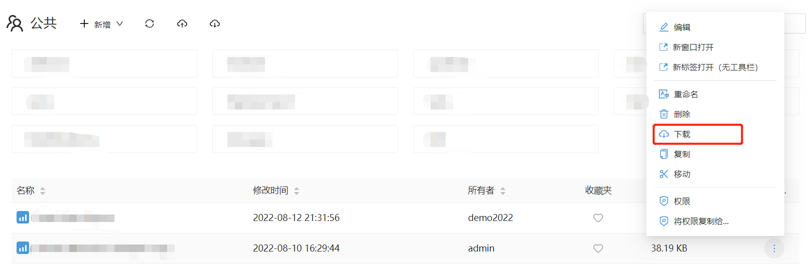
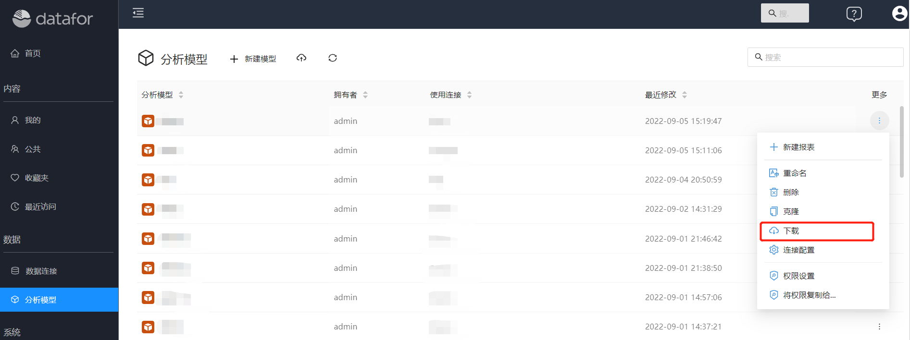
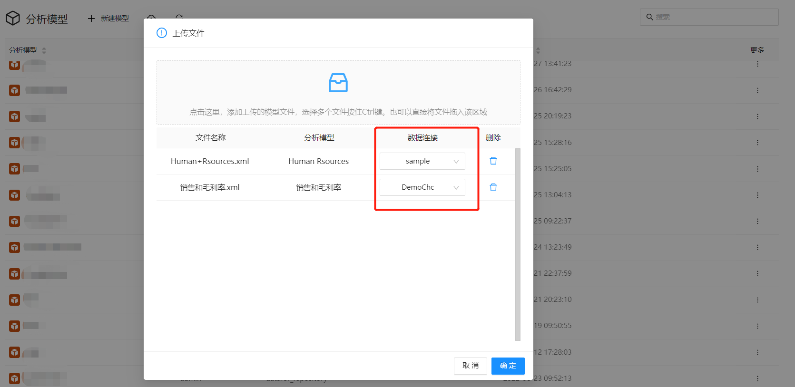

# 分析报表和模型的迁移

在很多场景下，需要将分析报表文件和模型迁移到另一台机器。

1. 硬件升级：当旧设备无法满足业务需求时，需要升级硬件设备，此时需要将BI系统的分析报表和分析模型迁移到新的设备上。
2. 数据中心迁移：当企业需要将数据中心迁移到新的位置或云上时，需要将BI系统的分析报表和分析模型迁移到新的环境中。
3. 业务扩展：当企业规模扩大或业务范围扩展时，需要增加新的分析模型和报表，此时需要将这些模型和报表迁移到新的设备上。
4. 维护和升级：当需要对BI系统进行维护或升级时，需要将现有的分析报表和分析模型备份并迁移至新的设备中，在完成维护或升级后，再将它们迁移回原始设备。
5. 业务合并：当企业进行合并或收购时，需要将不同企业的BI系统中的分析报表和分析模型整合到一起，此时需要将它们迁移到新的设备中。

Datafor提供了报表、文件夹、模型等资源的“下载”和“上传”方法，使得系统之间的资源迁移变得非常方便和灵活。

## 报表文件和文件夹迁移

1. 在报表文件或文件夹的操作菜单中，选择“下载”菜单。

   

   > 文件夹下载的压缩包中包含当前文件夹和所有子文件夹中的文件和文件夹。

2. 打开目标系统的文件夹，点击“上传”按钮。

   

3. 选择从源系统下载下来的报表文件。

   

4. 点击“保存”按钮，文件上传到目标系统的文件夹

   

## 分析模型迁移

1. 在分析模型列表操作菜单中选择“下载”菜单。

   

2. 在目标系统的分析模型列表工具栏上选择“上传”按钮。

   

3. 选择模型文件和设置“数据连接”

   

4. 点击“确定”按钮，上传成功。

