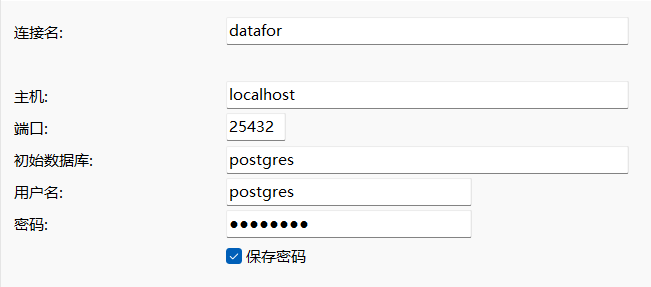
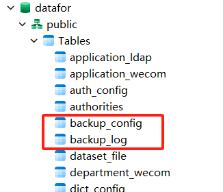

# 备份功能升级-v6.06

Datafor 6.06 对备份功能进行了升级，如果用 `datafor-update.jar` 升级之前的系统，在升级后，需要再手工创建2个表。

## 步骤

1. 启动 Datafor

2. 用数据库客户端工具登录 Datafor 资源数据库

   Datafor 默认的资源数据库是 PostgresSQL

   端口：25432

   数据库：datafor

   用户名：postgres

   密码：postgres

   <div align="left"></div>

3. 创建表

   表：backup_config

   ```sql
   -- DROP TABLE IF EXISTS "public"."backup_config";
   CREATE TABLE "public"."backup_config" (
     "id" varchar(64) COLLATE "pg_catalog"."default" NOT NULL,
     "name" varchar(200) COLLATE "pg_catalog"."default" DEFAULT 1,
     "folder" varchar(200) COLLATE "pg_catalog"."default",
     "cron" varchar(200) COLLATE "pg_catalog"."default",
     "jobid" varchar(255) COLLATE "pg_catalog"."default",
     "config" varchar(200) COLLATE "pg_catalog"."default",
     "enable" varchar(1) COLLATE "pg_catalog"."default" NOT NULL,
     "add_by" varchar(200) COLLATE "pg_catalog"."default",
     "add_time" timestamp(6),
     "update_by" varchar(200) COLLATE "pg_catalog"."default",
     "update_time" timestamp(6)
   )
   ;
   COMMENT ON COLUMN "public"."backup_config"."id" IS '主键';
   COMMENT ON COLUMN "public"."backup_config"."name" IS '任务名称';
   COMMENT ON COLUMN "public"."backup_config"."folder" IS '备份的根路径';
   COMMENT ON COLUMN "public"."backup_config"."cron" IS 'cron的json配置';
   COMMENT ON COLUMN "public"."backup_config"."jobid" IS '任务id';
   COMMENT ON COLUMN "public"."backup_config"."config" IS '自定义时的明细配置';
   COMMENT ON COLUMN "public"."backup_config"."enable" IS '是否启用';
   COMMENT ON COLUMN "public"."backup_config"."add_by" IS '创建用户';
   COMMENT ON COLUMN "public"."backup_config"."add_time" IS '创建时间';
   COMMENT ON COLUMN "public"."backup_config"."update_by" IS '更新用户';
   COMMENT ON COLUMN "public"."backup_config"."update_time" IS '更新时间';
   
   -- ----------------------------
   -- Primary Key structure for table backup_config
   -- ----------------------------
   ALTER TABLE "public"."backup_config" ADD CONSTRAINT "backup_config_pkey" PRIMARY KEY ("id");
   
   ```

   表：backup_log

   ```sql
   -- DROP TABLE IF EXISTS "public"."backup_log";
   CREATE TABLE "public"."backup_log" (
     "id" varchar(64) COLLATE "pg_catalog"."default" NOT NULL,
     "backupid" varchar(64) COLLATE "pg_catalog"."default",
     "name" varchar(200) COLLATE "pg_catalog"."default",
     "folder" varchar(200) COLLATE "pg_catalog"."default",
     "cron" varchar(200) COLLATE "pg_catalog"."default",
     "config" varchar(200) COLLATE "pg_catalog"."default",
     "status" char(1) COLLATE "pg_catalog"."default",
     "msg" text COLLATE "pg_catalog"."default",
     "add_by" varchar(200) COLLATE "pg_catalog"."default",
     "add_time" timestamp(6),
     "update_by" varchar(200) COLLATE "pg_catalog"."default",
     "update_time" timestamp(6)
   )
   ;
   COMMENT ON COLUMN "public"."backup_log"."id" IS '主键';
   COMMENT ON COLUMN "public"."backup_log"."backupid" IS '配置id，手动上传为null';
   COMMENT ON COLUMN "public"."backup_log"."name" IS '名称';
   COMMENT ON COLUMN "public"."backup_log"."folder" IS '备份的根路径';
   COMMENT ON COLUMN "public"."backup_log"."cron" IS 'cron的json配置';
   COMMENT ON COLUMN "public"."backup_log"."config" IS '同步范围配置';
   COMMENT ON COLUMN "public"."backup_log"."status" IS '0进行中1完成2出错';
   COMMENT ON COLUMN "public"."backup_log"."add_by" IS '创建用户';
   COMMENT ON COLUMN "public"."backup_log"."add_time" IS '创建时间';
   COMMENT ON COLUMN "public"."backup_log"."update_by" IS '更新用户';
   COMMENT ON COLUMN "public"."backup_log"."update_time" IS '更新时间';
   
   -- ----------------------------
   -- Primary Key structure for table backup_log
   -- ----------------------------
   ALTER TABLE "public"."backup_log" ADD CONSTRAINT "backup_log_pkey" PRIMARY KEY ("id");
   
   ```

   <div align="left"></div>

4. 重启 Datafor