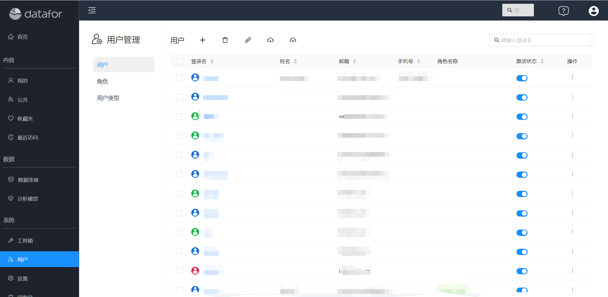
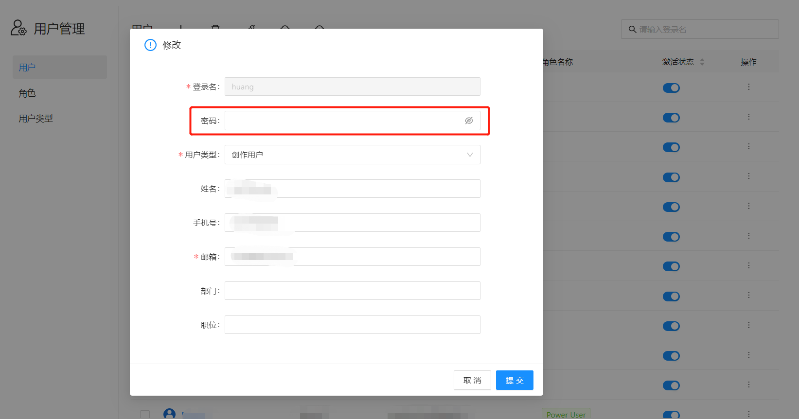
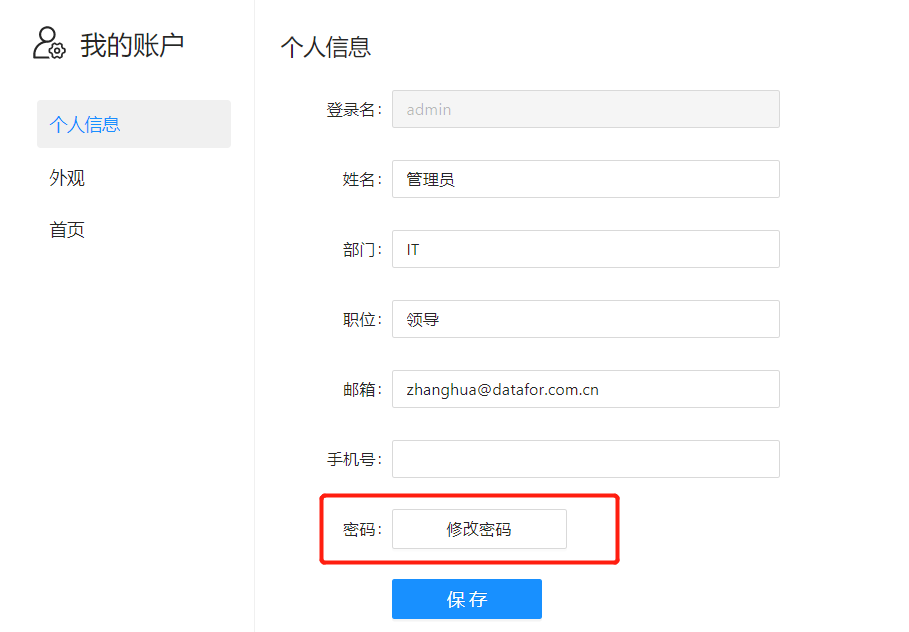

# 修改密码

为了保持密码的安全或由于密码泄露需要对密码进行修改，是用户经常会遇到的场景。下面我们介绍一下如何修改密码。

- **通过管理员修改密码**

  Datafor中的“超级管理员”和“管理员用户”都有权限修改用户的密码。

  1. 进入用户管理界面

     

  2. 点击用户“登录用户”，进入用户编辑窗口，在“密码”输入框中输入新的密码。

     

  

- **自己修改密码**

  进入“我的账户”管理界面

  

输入原密码和新密码

