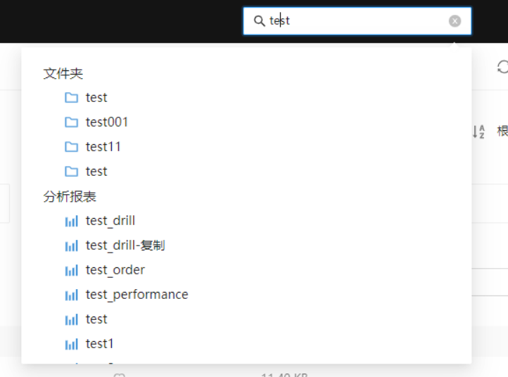
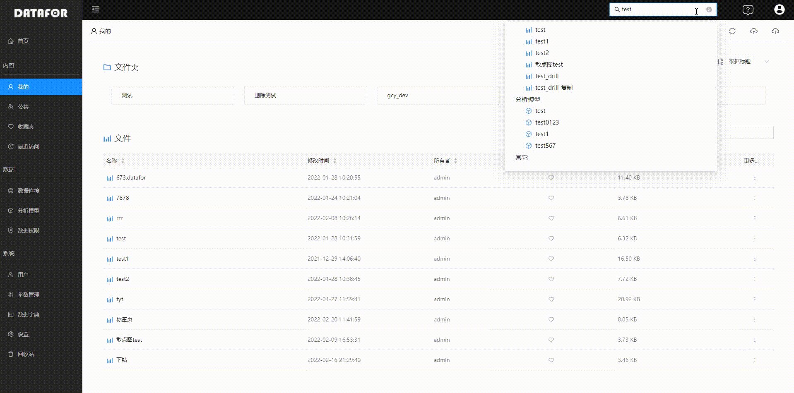

# 全局搜索

当系统中的内容越来越多，搜索成了必不可少的一个功能。DATAFOR提供全局搜索功能，通过全局搜索，轻松的找到你需要的内容。

全局搜索输入框在控制台的标题栏位置。

点击输入框，输入框会自动拉宽，方便输入内容。

在输入框里输入“关键字”，并按“回车键”，输入框下方自动弹出搜索结果框。

搜索结果分四组内容：

- 文件夹
- 分析报表
- 分析模型
- 其它

在搜索结果列表中，点击搜索到的项目，相应的内容会在控制台中打开。

再此点击搜索输入框，上次搜索的结果列表将重新打开，您可以再次选择结果项目。

如要清除上次搜索的内容，点击输入框中的X号，或者输入框中的搜索文字。