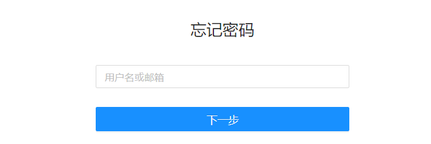

# 忘记密码

忘记密码后用户可以自己重置密码。

注：使用重置密码功能有两个前置条件：

> [!NOTE]
>
>   - 系统配置了邮箱服务器信息
>   - 用户信息中设置了用户的邮箱地址

1. 在登录系统页面点击“忘记密码”

   

2. 输入用户邮箱或登录名

   

3. 检查Datafor发送验证码的邮件

   

4. 输入验证码和设置新的密码

   

5. 完成重置密码，请用新的密码登录系统

   

