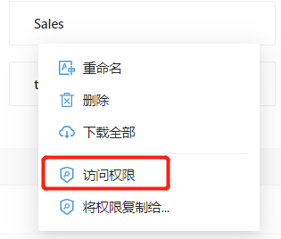
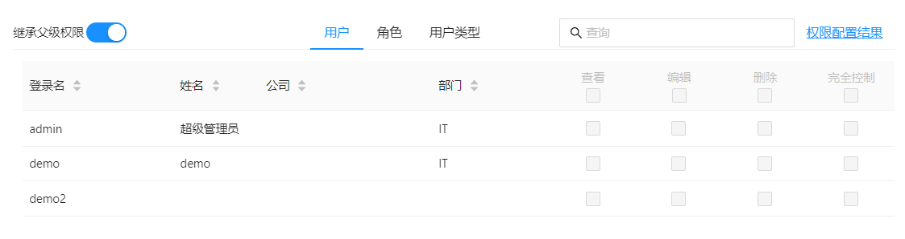
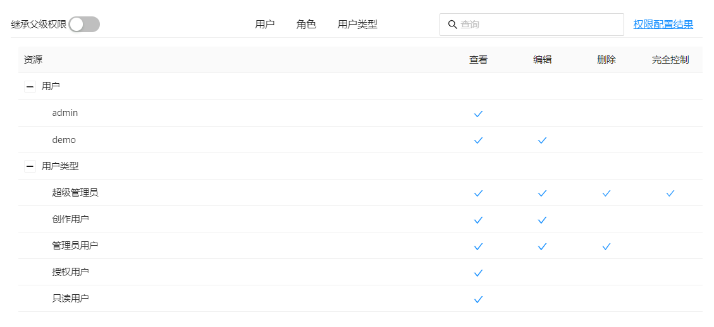
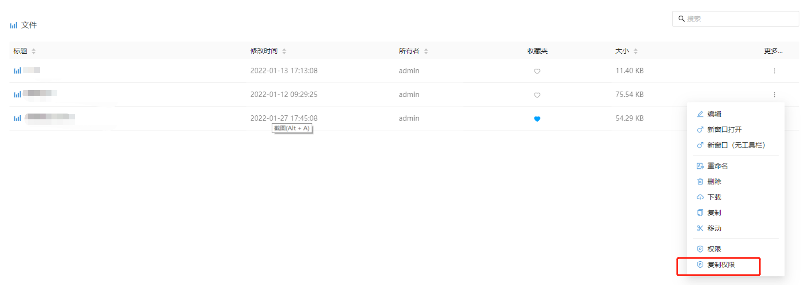
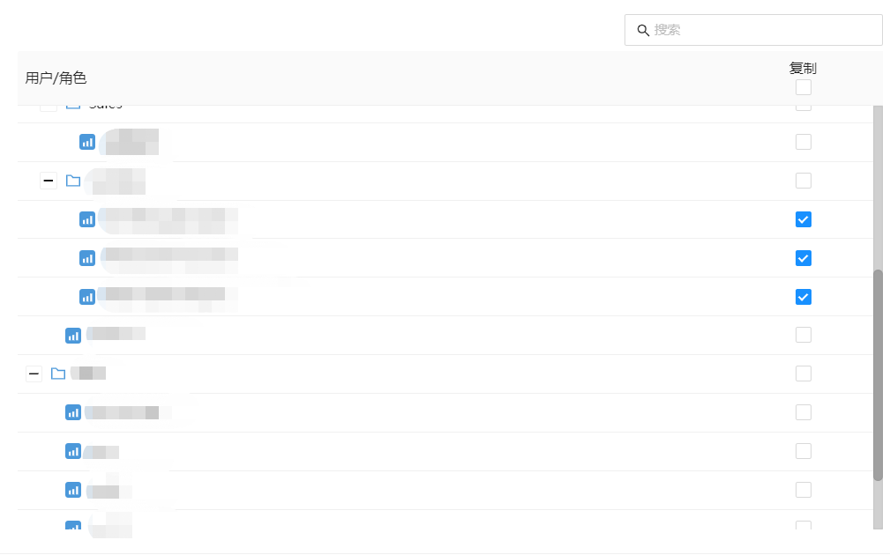

# 文件和文件夹的访问权限

”我的“文件夹中的文件和文件夹不能设置访问权限，只有登录用户自己可见。
“公共”文件夹中的文件和文件夹可以通过权限设置，控制用户的访问权限，包括查看、编辑、删除、完全控制。

点击文件或文件夹的操作菜单，选择“访问权限”菜单。

## 设置

勾选用户和角色对应的权限，确定按“保存“按钮。

| 权限         | 描述                                   |
| ------------ | -------------------------------------- |
| 继承父级权限 | 继承上级目录的所有访问权限。           |
| 查看         | 允许查看内容                           |
| 编辑         | 允许查看、编辑内容                     |
| 删除         | 允许查看、编辑和删除内容               |
| 完全控制     | 允许查看、编辑、删除，并且允许设置权限 |

## 查看配置结果

## 将访问权限复制给其它文件或文件夹

当文件和文件夹的权限和之前已经设置好权限的文件和文件夹的权限一致的情况下，可以使用“复制权限 “功能，避免重复设置权限。

在弹出菜单中选择“复制权限“。

 

选择需要复制权限的目录或文件，确定后按“保存“按钮.

