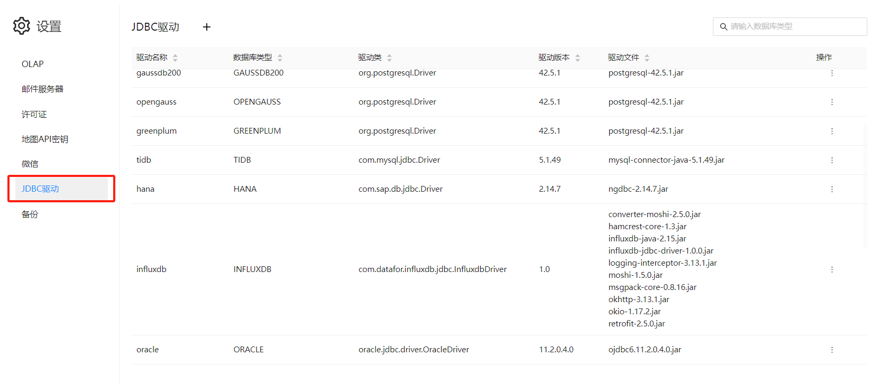
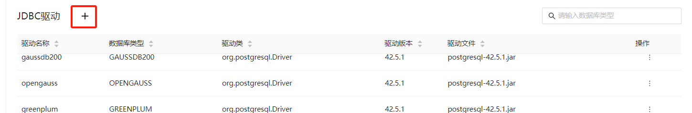
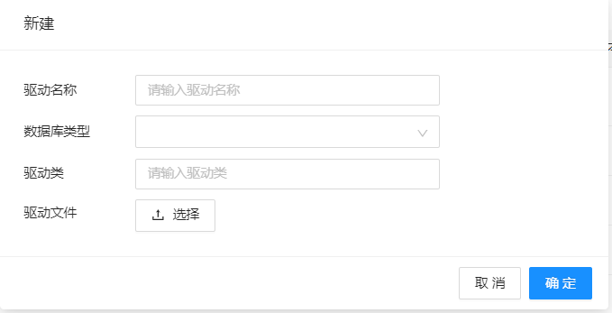
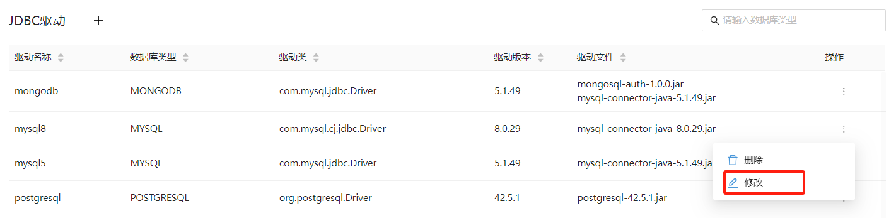
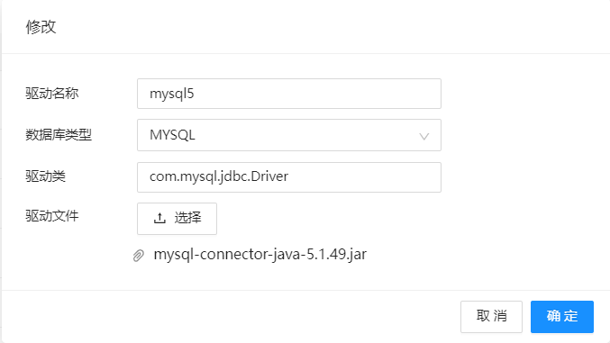
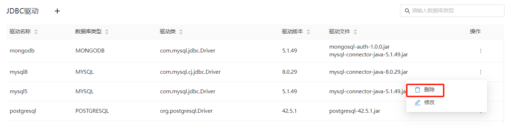

# JDBC驱动管理

Datafor 支持管理和配置不同版本的 JDBC 驱动程序，以支持不同版本的数据库。通过此功能，用户可以确保他们的数据库连接与相应的数据库版本兼容，从而避免由于驱动程序版本不匹配导致的连接问题。

## 操作指南

### 访问驱动管理界面

1. 登录 Datafor 平台。
2. 导航到设置页面，选择“JDBC 驱动”。

### 添加新的 JDBC 驱动

1. 点击 ”新建“ 按钮

   

2. 在弹出的窗口中：

   输入**驱动名称**

   - 选择**数据库类型**（如 MySQL、PostgreSQL 等）

   - 填写**驱动类**信息

   - 上传相应版本的 JDBC 驱动程序文件（.jar 文件）。

   - 点击“确定”按钮，完成驱动程序的添加。

   

### 更新现有 JDBC 驱动

1. 在驱动管理界面，找到需要更新的驱动程序。点击 “修改” 菜单。

   

2. 上传新的驱动程序文件，并更其它信息。点击“确定”按钮，完成驱动程序的更新。

   

###  删除 JDBC 驱动

在驱动列表的操作菜单，选择 “删除” 菜单。

