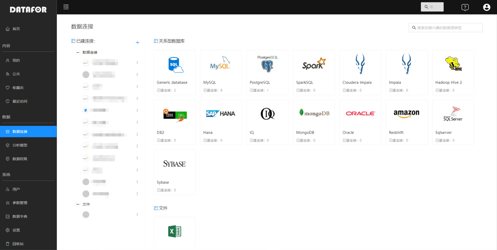
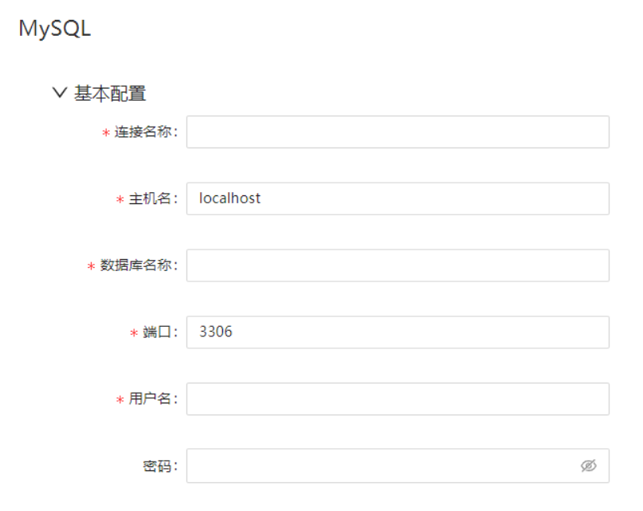
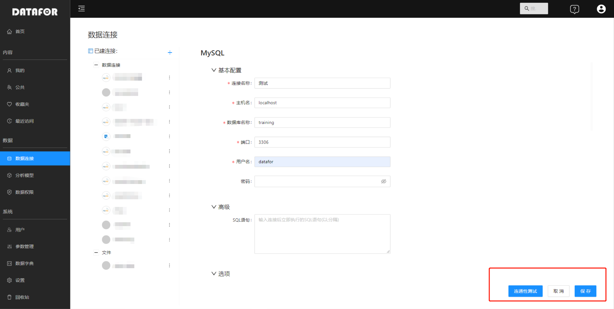
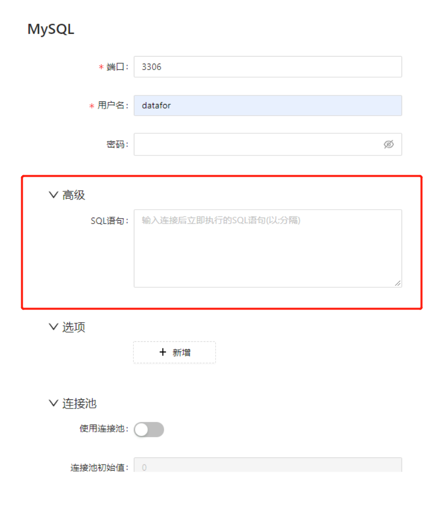
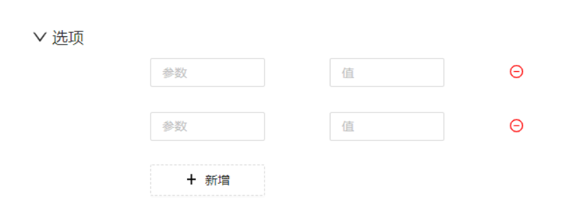
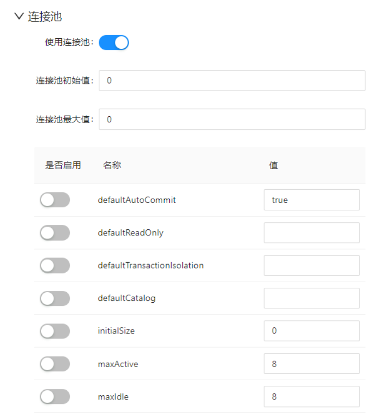

# 创建数据库连接

DATAFOR支持多种数据来源的数据。如果您的数据源是数据库，则在访问数据前连接到数据库。通过DATAFOR的”数据源“中定义数据库连接。

## 选择数据库类型

点击”数据源“菜单，进入数据连接管理界面。

点击需要连接的数据库类型图标。

## 创建连接

不同的数据库的配置项有所不同，这里我们用MySql为例说明如何建立连接。

1. 在连接配置页面的”基本配置“标签下，输入连接信息

| 配置项     | 描述                                                         |
| ---------- | ------------------------------------------------------------ |
| 连接名称   | 唯一描述此连接的名称。名称可以包含空格，但不能包含特殊字符（例如 #、$ 和 %） |
| 主机名     | 数据库的服务器的名称。或者，通过 IP 地址指定主机。           |
| 数据库名称 | 数据库的名称。如果您使用的是 ODBC 连接，请在此字段中输入数据源名称 (DSN)。 |
| 端口号     | TCP/IP 端口号（如果它不同于默认值）                          |
| 用户名     | 用于连接数据库的用户名                                       |
| 密码       | 用于连接数据库的密码                                         |

2. 单击”测试连通性“。如果建立连接，将显示成功消息。

3. 单击“保存”关闭连接测试对话框。

## ”高级“配置项目

1. 选择连接配置页面的”高级“标签

2. 输入SQL语句

| 配置项   | 描述                              |
| -------- | --------------------------------- |
| SQL 语句 | 输入用于初始化此连接的 SQL 语句。 |

## 设置数据库的特定选项

1. 选择连接配置页面的”选项“标签
2. 点击”新增“按钮，增加参数输入项
3. 在”参数“输入框中输入参数名称，在”值“输入框中输入参数值

## 定义连接池

      

1. 选择连接配置页面的”连接池“标签
2. 打开”使用连接池“开关
4. 输入连接池配置参数

   | 选项 &emsp;&nbsp;&nbsp;&nbsp;&nbsp;&nbsp; | 描述                                                         |
   | ----------------------------------------------- | ------------------------------------------------------------ |
   | 启用连接池&nbsp; &nbsp;&nbsp; &nbsp;            | 启用连接池。                                                 |
   | 池大小                                          | 最初的设置连接池的初始大小。最大设置连接池中的最大连接数。   |
   | 参数                                            | 您可以定义其他自定义池参数。单击任何参数可查看该参数的简短说明。最常用的参数是validationQuery。该参数根据您的 RDBMS 连接略有不同。基本的数据库使用以下值进行验证查询：对于 Oracle 和 PostgreSQL，使用**Select 1 from dual**。对于 MS SQL Server 和 MySQL，使用**Select 1**。 |