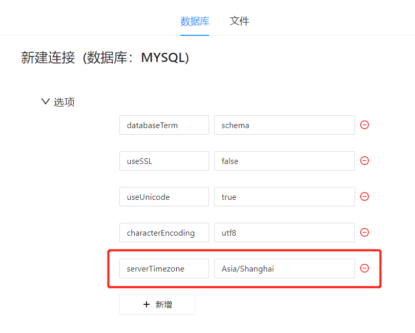

# JDBC时区设置

在 Datafor 中使用 JDBC 连接到数据库时，时区问题可能导致时间数据的不一致和混乱。为了解决这个问题，可以通过以下步骤确保时区设置正确，并在 Datafor 中显示一致的时间数据。

### 1. 为什么需要设置 JDBC 时区

在跨不同时区的应用程序中，如果没有正确设置时区，可能会导致时间数据的混乱。例如，时间戳数据在存储和检索过程中可能会出现差异。设置 JDBC 时区可以确保客户端和数据库服务器之间的一致性。

### 2. 配置 Datafor 数据源的时区

在数据库连接配置的“选型”中新增参数，设置时区参数和值。

### 3. 验证时区设置

在配置时区设置后，确保验证时间数据是否正确显示：

1. 在 Datafor 中创建时间相关的可视化图表。
2. 确认时间数据与预期一致。

### 结论

通过正确设置和调整时区，可以确保 Datafor  中时间数据的一致性和准确性。
