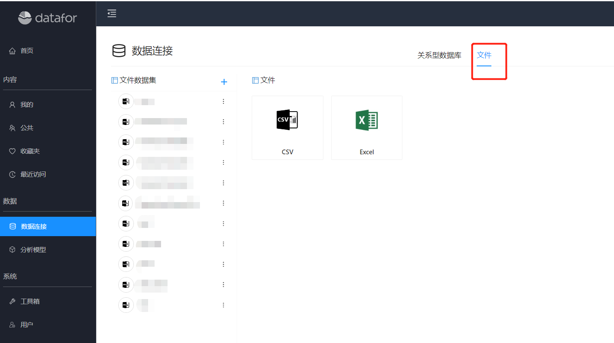
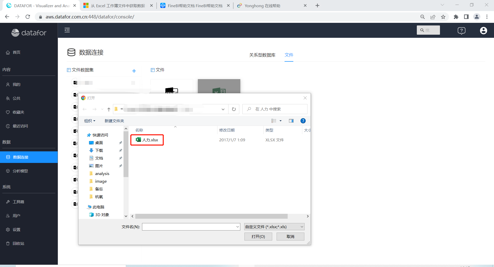
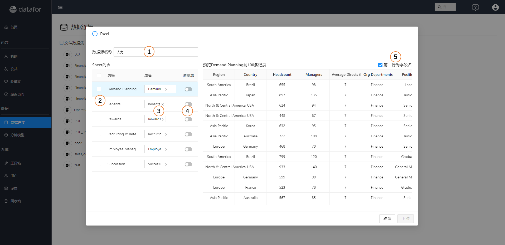
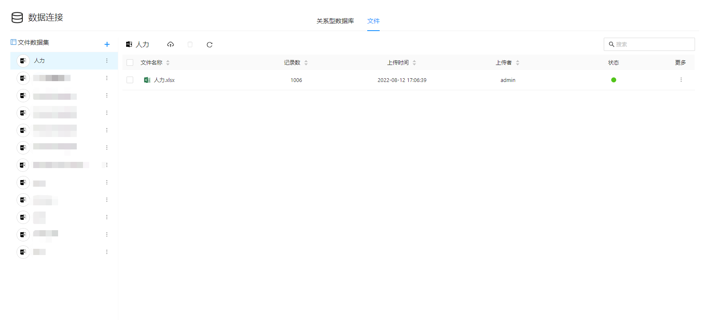
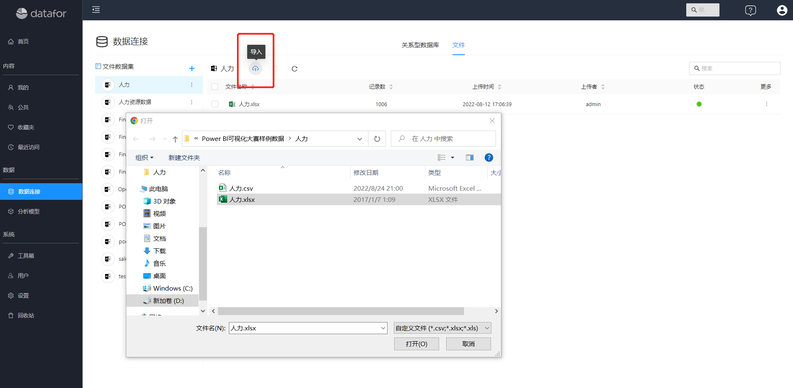
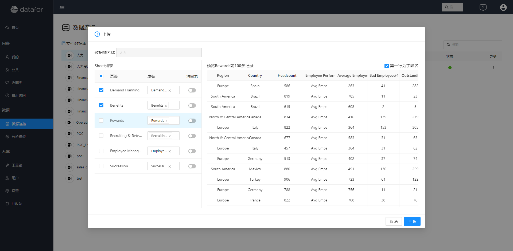
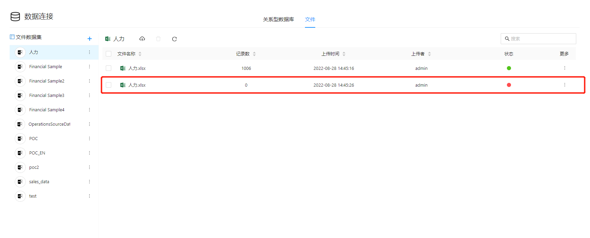
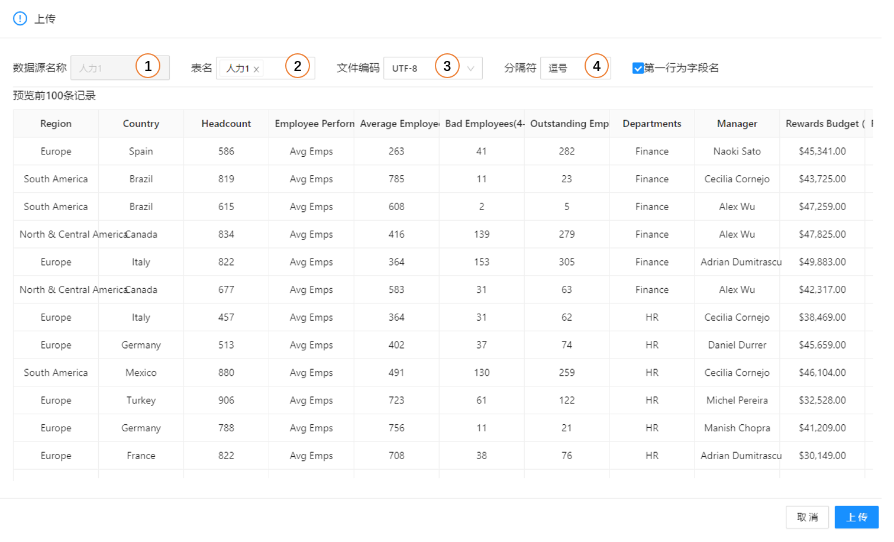

# 文件数据集

Microsoft Excel 和CSV文件是将数据导入 Datafor 的最常见方式之一。

Datafor支持导入 Excel 2007 和更高版本中创建的工作簿。 工作簿必须另存为 .xlsx 或 .xlsm 文件类型。

## 将 Excel 数据导入 Datafor

1. 在Datafor导航菜单中，点击”数据连接“，并选择”文件“标签页。

   
  

2. 点击”Excel“按钮，选择本地文件

   

3. 选择和设置导入数据

   

    | 序号 | 说明                                                 |
    | ---- | ---------------------------------------------------- |
    | 1    | 设置数据集名称                                       |
    | 2    | 选择需要导入的”Sheet“                                |
    | 3    | 设置sheet页对应的表名，不同的sheet可以设置相同的表名 |
    | 4    | 表中的数据是否需要清空                               |
    | 5    | 设置sheet页中的第一行是否作为标题行                  |

4. 点击”上传“按钮，上传文件中的数据

   

## 追加导入文件数据

1. 点击”导入“按钮，选择文件

   

2. 选择sheet页，设置需要追加的”表“或设置新的数据表。

   

3. 点击”上传“按钮，列表中显示追加导入的数据文件记录

   

## 将CSV文件导入Datafor

将CSV文件导入Datafor和Excel文件导入非常相似。

1. 在Datafor导航菜单中，点击”数据连接“，并选择”文件“标签页。点击”CSV“图标，选择本地CSV文件。

2. 设置CSV文件数据

   

    | 序号 | 说明              |
    | ---- | ----------------- |
    | 1    | 设置数据集名称    |
    | 2    | 设置数据表的名称  |
    | 3    | CSV文件字符集编码 |
    | 4    | CSV文件数据分割符 |
