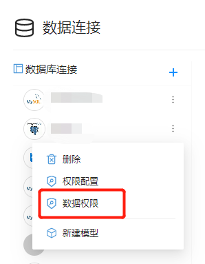
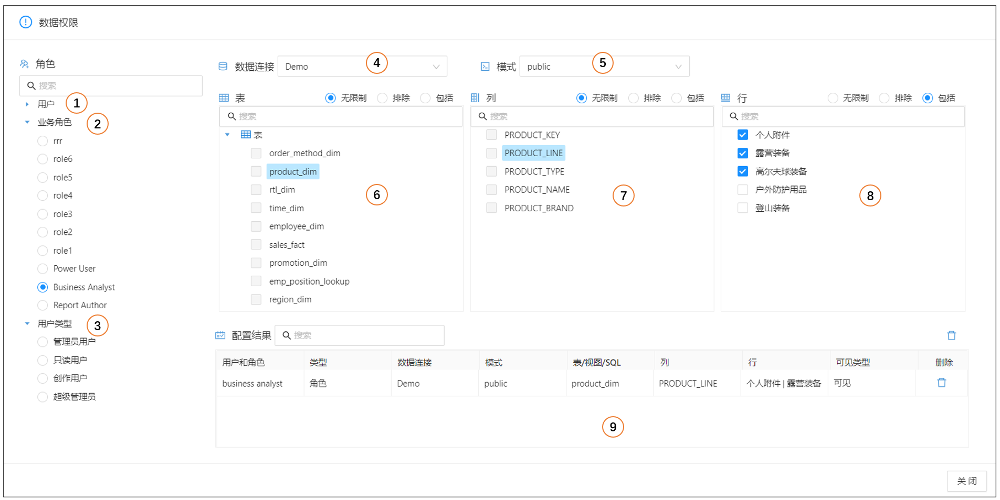
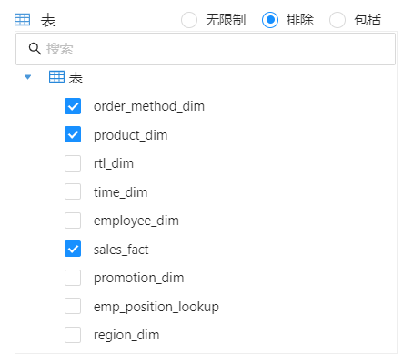
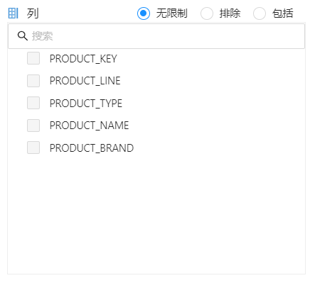
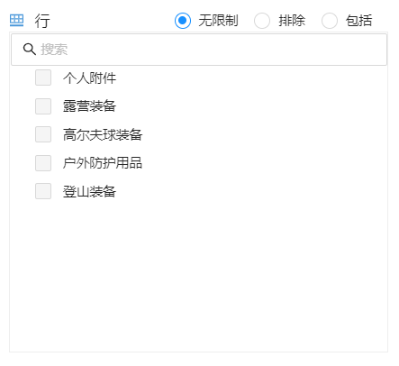

# 数据权限

Datafor支持为不同的用户、角色、用户类型设置数据访问权限，权限控制粒度是数据库表的行和列。
数据权限控制设置在”数据连接“上，分析模型可以控制是否应用数据源上的权限设置。

数据权限设置入口在”数据源“的操作菜单中：

## 权限设置

选择数据连接的”数据权限“操作菜单，显示数据权限配置界面。

| 编号 | 内容     | 说明                           |
| ---- | -------- | ------------------------------ |
| 1    | 用户     | 选择需要设置数据权限的用户     |
| 2    | 角色     | 选择需要设置数据权限的角色     |
| 3    | 用户类型 | 选择需要设置数据权限的用户类型 |
| 4    | 数据连接 | 选择数据连接                   |
| 5    | 模式     | 数据连接里的模式（schema）     |
| 6    | 表       | 数据连接里的所有表和视图       |
| 7    | 列       | 选中的表的字段信息             |
| 8    | 行       | 选中的字段的内容               |
| 9    | 配置结果 | 配置的数据权限信息             |

### ”表“设置

设置表的访问权限。

- **无限制**：不做设置。
- **排除**：如果分析模型中用到了该表作为维度表，那么模型的维度不可见；如果分析模型用该表作为事实表，那么模型将不可用。
- **包括**：分析模型中使用了这些表作为维度表的维度可见，其它维度不可见。

### ”列“设置

设置数据列的访问权限。

- **无限制**：不做设置
- **排除**：排除的字段在维度和指标中不可见。
- **包括**：包括的字段在维度和指标中可见。

### ”行“设置

设置数据行的访问权限。

- **无限制**：不做设置
- **排除**：排除的”行“在维度和指标的”值“中不可见。
- **包括**：包括的”行“在维度和指标的”值“中可见。

