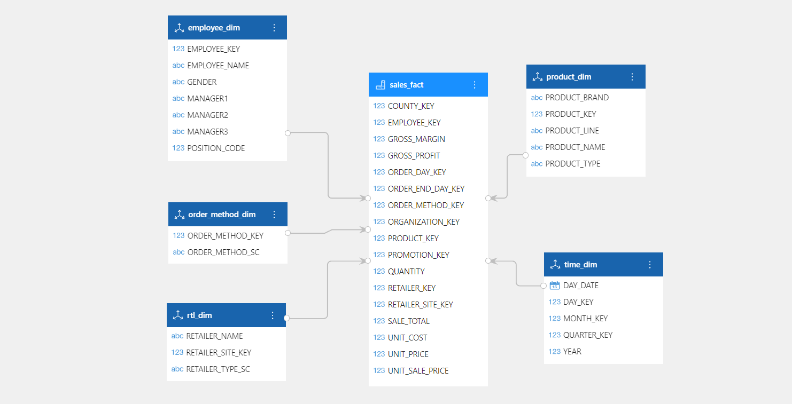

# 分析模型概述

DATAFOR分析模型采用多维模型。多维模型是用于支持多维分析的一种数据结构，它能够将数据从不同的维度进行切分，以实现数据的多角度分析。多维模型能够满足不同业务领域和层次的分析需求，让用户可以通过分析数据获取到全新的业务视角和决策依据。在企业管理和决策中，多维模型可以用于市场分析、销售分析、客户分析、财务分析等方面。

## 维度表和事实表
在多维模型中，维度表和事实表是最基本的两种表。维度表用于描述不同维度的属性信息，例如时间维度、地域维度、产品维度等，它们用于筛选、切分数据，以实现多维分析。事实表则用于描述具体的度量信息，例如销售额、访问量等，它们与维度表通过共享相同的键进行关联，以实现数据的多维度分析。

## 星型模型和雪花模型

在多维模型中，星型模型和雪花模型是最常用的两种模型。Datafor支持创建星型模型和雪花模型。

### 星型模型

星型模型（Star Schema）是一种常见的多维数据模型，它由一个中心的事实表（Fact Table）与多个维度表（Dimension Table）构成，中心的事实表包含了各种度量（Measures）数据，而维度表则包含了描述这些度量数据的各种属性信息。

在星型模型中，维度表和事实表是直接相连的，形成一个类似于星形的结构，因此得名为“星型模型”。维度表通常包含多个列，这些列是描述度量数据的属性信息，比如时间维度表包含年、月、日等时间属性；产品维度表包含产品名称、颜色、品牌等产品属性；客户维度表包含客户名称、地址、联系方式等客户属性。

中心的事实表通常包含一个或多个度量数据列，度量是指需要被度量的实际数据，比如销售额、销售量等等。事实表中的每一行数据都代表一个度量事件，这些度量事件与维度表中的一行或多行数据相联系，组成了一个星型模型。

### 雪花模型

雪花模型是在星型模型的基础上，将部分维度表进一步分解成多张表，从而形成了类似雪花的结构，因此得名雪花模型。雪花模型的优点是可以灵活地表达复杂的多维分析需求，但是缺点是查询性能相对较低。

## 如何设计多维模型

在设计多维模型的过程中，需要注意以下几点：

1. 确定业务需求

   在设计多维模型之前，需要了解业务需求和分析目标，明确分析目的和重点，以及需要分析的指标和数据来源。这一步是非常重要的，因为多维模型的设计需要基于业务需求和分析目的来进行，只有明确了这些，才能确保模型的有效性和准确性。

2. 确定维度表 

   根据业务需求和分析目标，识别出需要分析的维度。维度是描述事实的属性，比如时间、地点、产品、客户等。维度具有层次结构，比如时间维度可以按年、季度、月、日等层次进行划分，产品维度可以按类别、品牌、型号等层次进行划分。

3. 确定事实表

   在确定事实表时，需要考虑业务过程中发生的事件或交易，以及需要分析的指标。事实通常是数字型的数据，比如销售额、销售量、利润等，也可以是其他类型的数据，比如客户满意度等。在确定事实时，需要考虑粒度，也就是每个事实对应的实际事件是什么，以及需要对这些事件进行什么样的度量。

4. 设计星型模型或雪花模型
   根据维度表和事实表的关系，设计星型模型或雪花模型。在星型模型中，每个维度表都与事实表直接关联，形成一个星型结构；在雪花模型中，每个维度表可能与其他维度表进行关联，形成一个类似于雪花的结构。

5. 设计维度层次结构

   对于每个维度表，需要设计其层次结构，以便用户能够按照不同的层次对数据进行分析和查询。层次结构通常由多个维度层级组成，如时间维度可以按照年、季度、月份等层级进行分析。

6. 优化模型

   在设计模型之后，需要对模型进行优化。优化模型可以提高查询性能，包括增加聚集事实表、合并维度、使用分区等技术手段。同时，还需要对模型进行测试和调优。