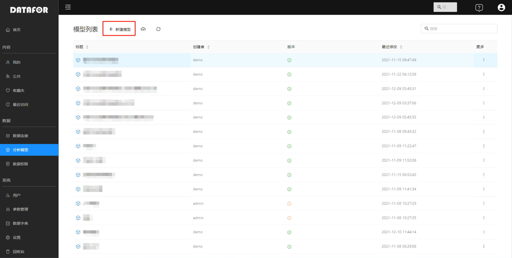
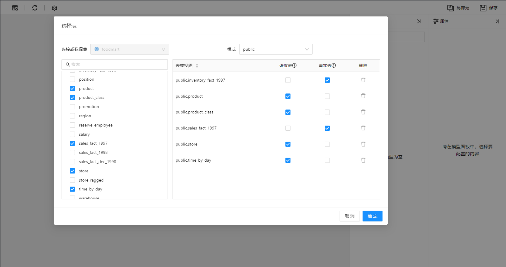
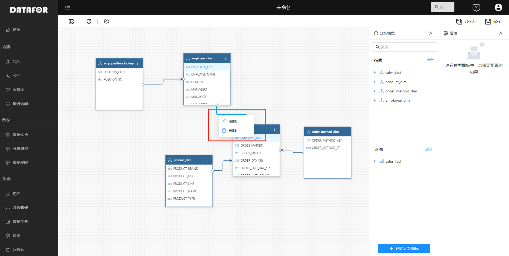

# 创建分析模型

创建分析模型的前提是已经建立“数据连接”或创建了“文件数据集”。

## 模型列表

在控制台左侧导航，选择“分析模型”菜单，进入分析模型列表。通过模型列表可以对分析模型进行管理。

 

## 创建模型

创建分析模型有以下几个步骤：

### 1. 选择连接或数据集中的表和视图

选中需要分析的表或视图，并设置“维度表”和“事实表”。

<!--模型中至少有1个维度表和1个事实表-->

 

设置完成，点击“确定”按钮，进入模型编辑窗口。

 

### 2. 设置表关系

DATAFOR会自动给事实表（外键）和维度表（主键）建立关系（外键和主键的名字一致）。

如果外键和主键名字不一致，可以手动通过拖拉字段方式建立连接。鼠标拖动方向是从“主键”拖动到“外键”。

 

通过右键点击表之间的连接线，可以删除和修改连接。

 

### 3. 修改自动生成的模型

当表之间的关系建立好后，分析模型会自动生成。您可以根据实际需要修改模型，满足对数据的分析需求。

模型设计工具提供如下修改功能：

| 模型元素&emsp;&emsp; | 功能点&emsp;&emsp;&emsp;&emsp;&emsp;&emsp;&emsp;&emsp;                                                       |
| -------- | ------------------------------------------------------------ |
| 维度     | - 修改维度名称 - 添加描述 - 设置隐藏 - 修改维度类型 |
| 维度字段 | - 修改名称 - 添加描述 - 设置隐藏 - 设置排序字段 - 修改列 - 成员格式化 |
| 层次     | - 新建层次 - 删除层次 - 隐藏层次                       |
| 度量组   | - 修改度量组名称 - 添加度量组描述 - 设置隐藏         |
| 度量     | - 修改维度名称 - 添加描述 - 设置隐藏 - 修改数据格式 - 修改聚合方式 |
| 计算度量 | - 创建计算度量 - 修改名称 - 添加描述 - 隐藏计算度量 - 修改计算度量格式 - 修改聚合方式 |
