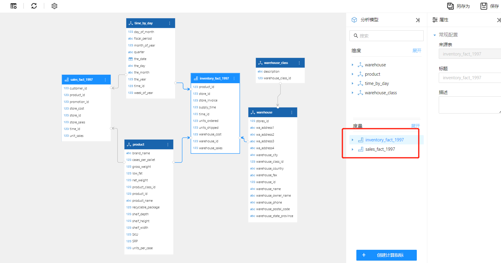

# 多事实表模型

Datafor 支持复杂的在线分析处理（OLAP）查询，能够快速访问和处理多维数据。其高级特性之一是支持多事实表模型的设计和应用。

## 什么是多事实表模型？

多事实表模型指在一个模式中包含多个事实表。这些事实表可以共享共同的维度表，从而允许跨多个业务流程或领域进行更复杂的分析查询。

### 关键组件

1. **事实表**：模式中的中心表，包含用于分析的定量数据（如销售额、库存、订单）。每个事实表通常包括度量值（如销售金额、数量）和链接到维度表的键。
2. **维度表**：存储与事实相关的描述性属性（如时间、产品、客户）的表。这些表帮助用户以各种方式切片和切块数据。
3. **共享维度**：被多个事实表使用的维度。例如，时间维度可能同时链接到销售和库存事实表。

## 何时使用多事实表模型

- **复杂业务流程**：当业务流程涉及多个相关但独立的事实，需要同时进行分析时。
- **共享维度**：当多个事实表需要共享维度以提供不同业务指标的统一视图时。
- **详细分析**：当需要详细的粒度和复杂的关系来进行数据分析时。

## 如何创建多事实表模型

### 场景

一家零售公司希望同时分析销售和库存数据。公司有两个事实表：`sales_fact`和`inventory_fact`，它们共享时间和产品等维度。

### 步骤

1. 将`sales_fact_1997` 和`inventory_fact_1997` 设置为**事实表**，其它表设置成**维度表**。

   

2. Datafor 自动创建了一个：**雪花多事实表模型**。可以看到模型的度量区域有2个**度量组**，`time_by_day`, `product` 两个**共享维度**， `warehouse` 和 `warehouse_class` 组成一个**雪花维度**。

   

## 优势

- **统一视图**：在单一模型中提供不同业务指标的综合视图。
- **可扩展性**：易于扩展，能够包括额外的事实表和共享维度。
- **增强分析**：支持跨多个业务流程的详细和复杂分析。
