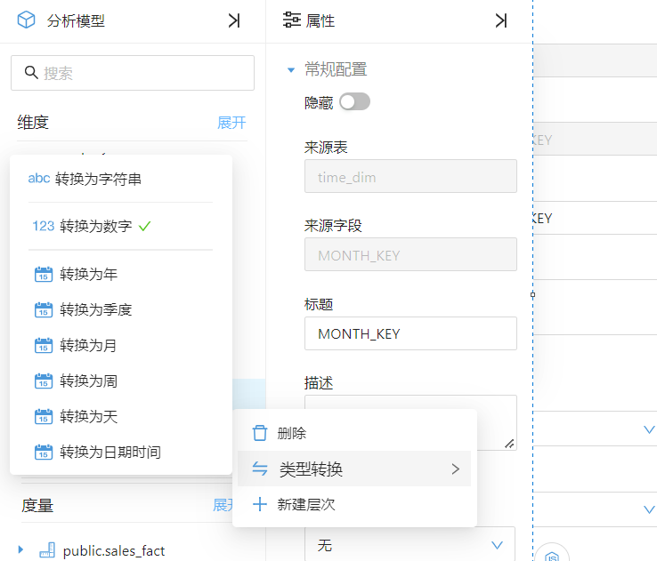
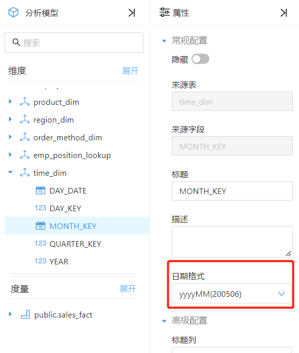
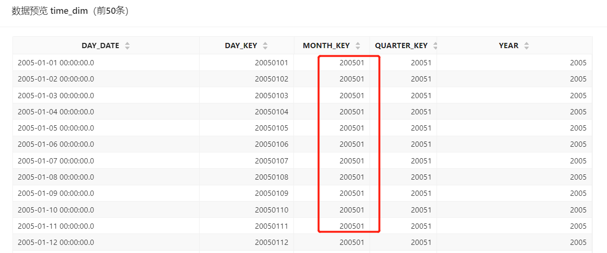
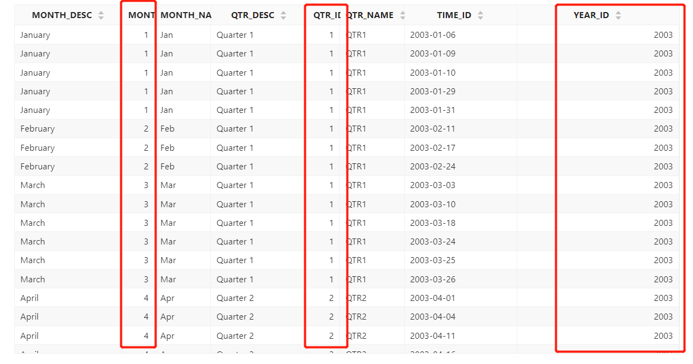
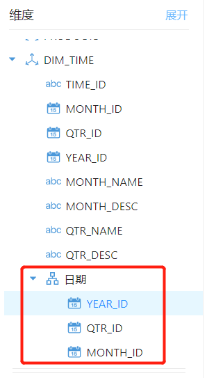

# 时间维度

时间是数据分析中最常用的一个维度。时间维度可能是一个特定的时间维度表，表中存放了时间、日期、年、月等字段信息，也可能是某个业务表中的时间或日期字段。Datafor的分析模型不需要设置特定的“时间维度”，任何时间字段都可以作为“时间维度”来使用。

## 时间字段

1. ### 将字段转换成时间类型

   Datafor在建模过程中会自动识别数据表中的“时间戳”类型字段。

   如果数据表中存放的不是“时间戳”类型字段，而您要将它作为时间字段来使用，那么您可以在模型上将字段转换成时间类型字段。右键字段或点击字段右侧的操作按钮，在弹出菜单中选择您要转换的时间类型。

   

2. ### 设置时间字段格式

   在“属性”面板中配置日期格式。

   

   
   

注意：日期格式必须和表中存放的数据格式一致。您可以通过预览数据，查看表中字段的数据格式。

   

## 时间层次（hierarchy）

“时间层次”有什么用？

如果您的数据字段里存放的时间是不完整的时间信息，比如：5月，没有年份信息，而年份信息是在另外一个字段中存放。那么您就可以通过创建“时间层次”来进行时间相关的查询。Datafor会自动将不同层次的时间信息组合成时间字段进行查询。

比如您的数据表是这样的，其中季度和月份都是没有年份信息，无法当成时间字段来进行数据查询。

   

您可以将这三个字段分别转换成时间类型，并设置正确的“日期格式”，同时创建一个“层次”（hierarchy）

   

