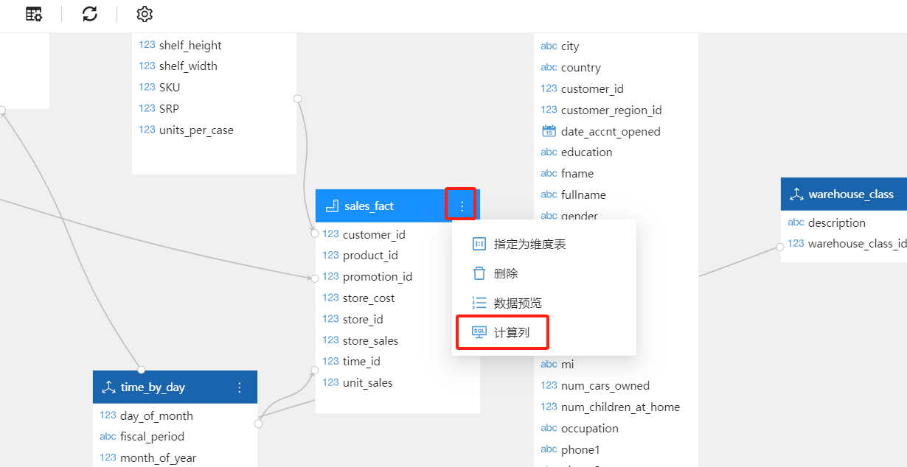
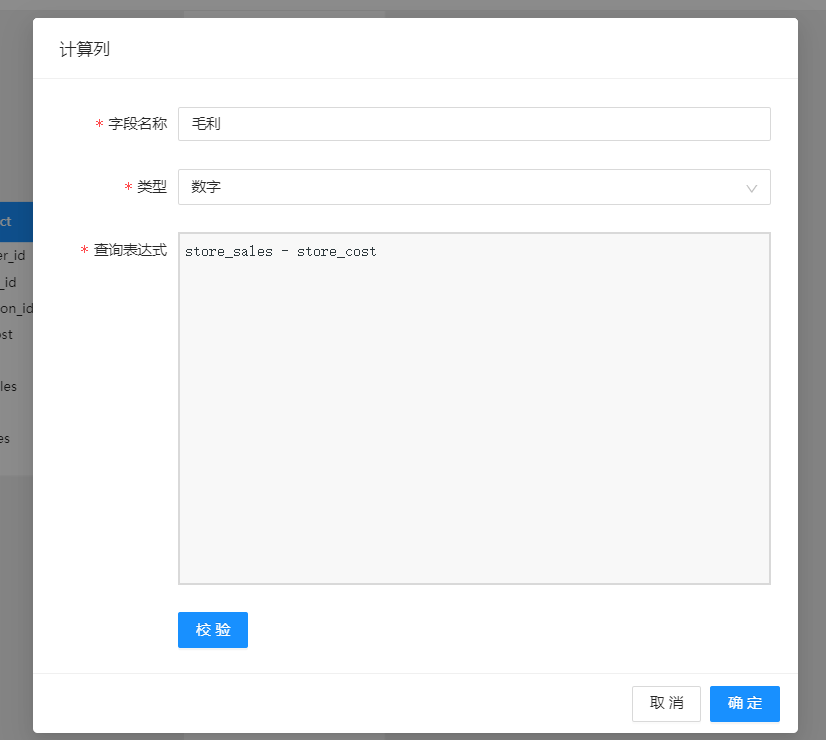
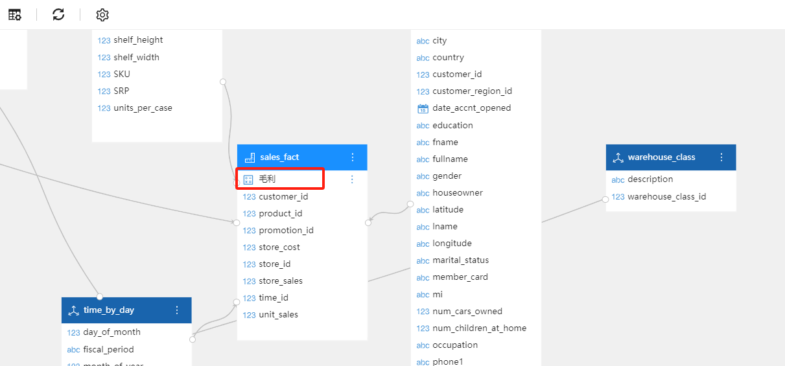
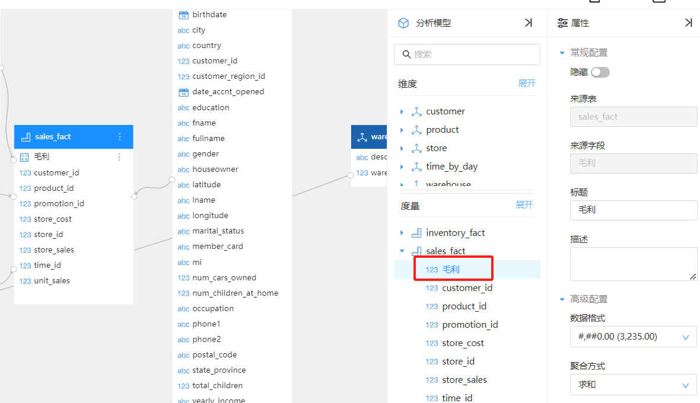

# 计算字段

计算字段是在分析模型中使用 SQL公式创建的新的数据字段。

## 何时使用计算字段

使用计算字段的情况包括：

- 需要逐行计算时。
- 基于现有列创建新数据字段时。
- 通过额外的信息增强数据模型，

## 如何创建计算字段

1. 进入建模视图

   点击数据表右上角菜单按钮，在弹出菜单中选择 计算列“

   

   
2. 输入列名称，类型和SQL表达式。校验通过后，点击`确定`按钮。

   

   
3. 可以看到在sales_fact表里多了一个字段：“毛利”

   

   
4. 将创建的计算字段  “毛利” 拖动到模型中。

   

   
5. 接下去可以在报表中使用此计算字段。