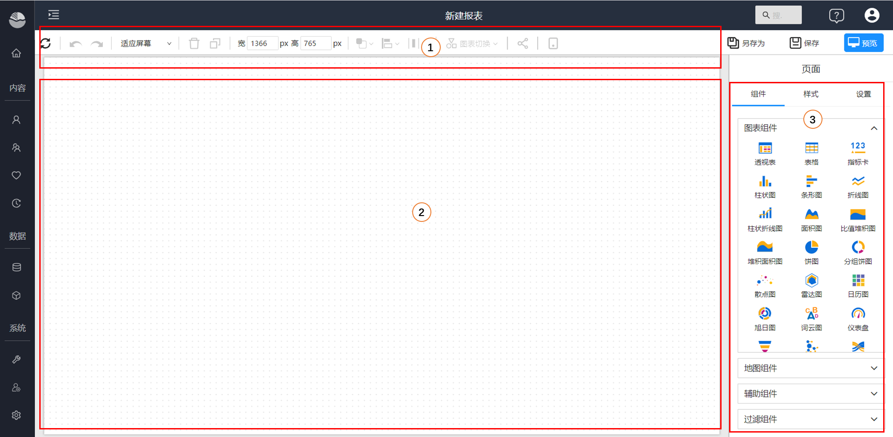
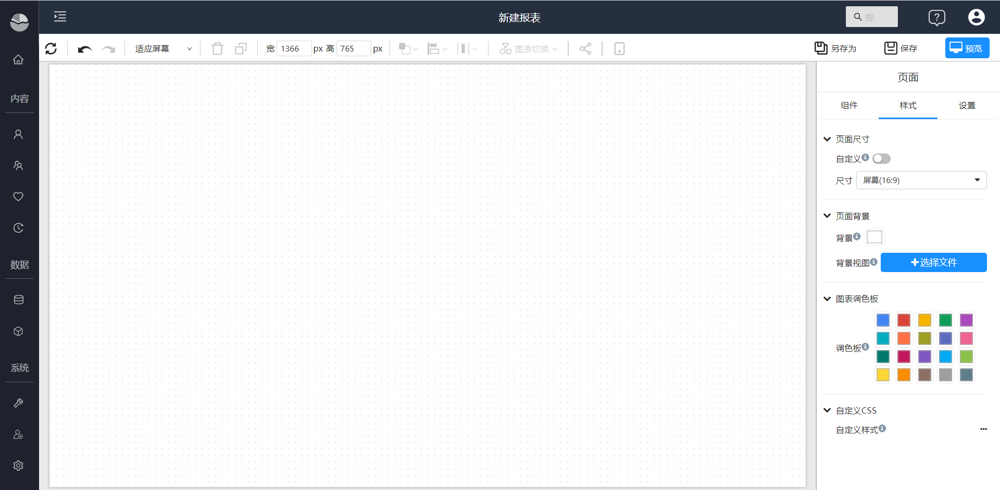
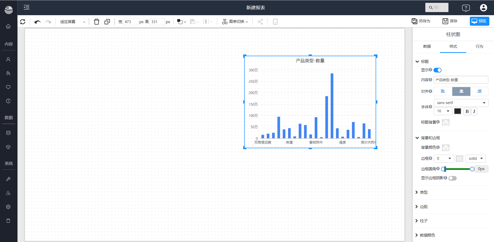

# 设计器概述

您可以通过拖拽方式用分析报表设计器进行探索式分析和制作所见即所得的数据分析报表。

1. 工具条：常用功能区域，包括数据刷新、回退和前进，页面布局，删除，复制，对齐，层叠，分享等功能。
2. 画布区：创作区，您可以调整画布大小，设置背景，在画布上放置可视化元素。
3. 组件和配置区：这块区域根据您在画布上选择的可视化元素切换内容。没有选中可视化元素时，您可以在此选择可视化组件和元素添加到画布上，同时进行页面级别的样式和行为配置。当选中画布上的组件和元素时，此区域显示该组件的配置项目。

## 页面配置

页面配置内容包括组件选择、样式、设置。

- 样式：页面大小，背景，调色板和自定义CSS等。

  

- 设置：控制页面上所有组件的组件菜单，设置最大查询记录，自定义定义页面事件

  

## 组件配置

组件配置包括组件的数据配置，数据筛选，组件样式和组件行为。

- 数据，配置组件的数据和筛选。

  

- 样式，配置组件的样式。

  

- 行为，配置组件的交互行为，自定义事件等。

  

