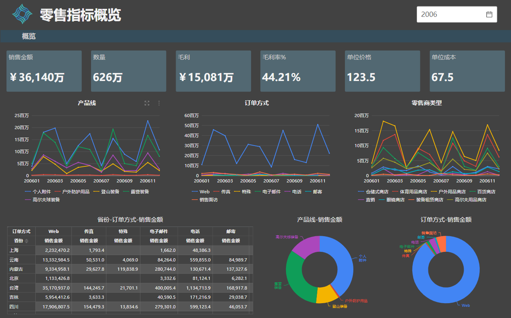

# 组件全屏显示

组件全屏显示的用途：

- 在小屏幕上查看
- 在会议上需要重点展示某个组件数据

## 如何进入全屏模式

每个数据组件都有个“组件菜单”，组件菜单工具条上有个“放大”按钮，点击此按钮可以全屏放大组件。

全屏显示的组件，保留"下钻"，“联动“等功能。点击左上角的”返回“按钮，回到原页面。

## 全屏背景色设置

报表页面设计时可能设置了背景色或者背景图片，导致组件全屏放大后默认颜色和组件的样式设置不匹配。这时我们可以改变”放大背景色“，使得全屏后的背景色和组件样式配置匹配。

比如页面：

组件默认的放大背景色是白色。我们发现组件的文字颜色看不清。

这时候需要修改”放大背景色“。我们将组件”放大背景色“修改成和主页面背景色一样的深颜色。

