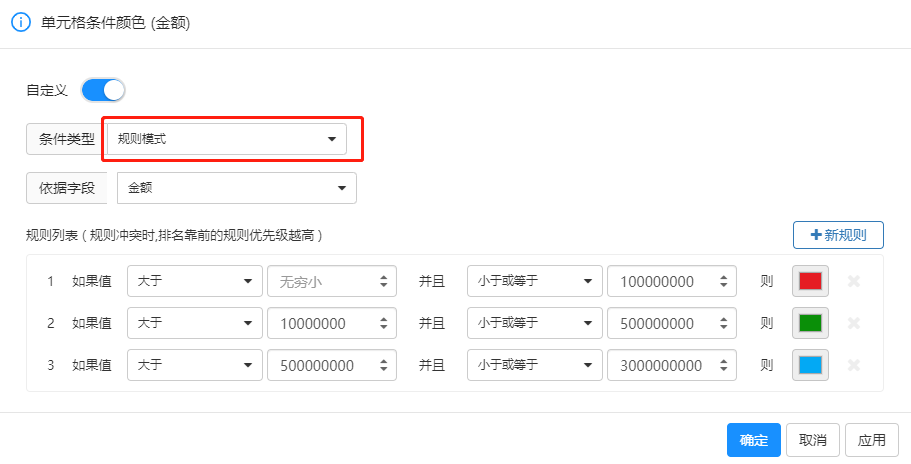
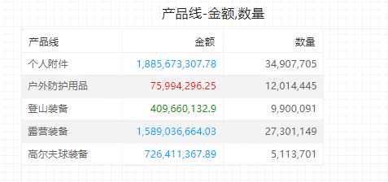

# 条件颜色

在 Datafor 中，条件颜色是一种强大的数据可视化功能，通过根据特定条件设置颜色，可以帮助用户快速识别和分析数据的模式和异常。本文将详细介绍如何在 Datafor 中使用条件颜色功能。

## 什么是条件颜色

条件颜色是指根据数据值或表达式的结果，为图表中的元素（如柱状图的柱子、折线图的线条、表格的单元格等）自动应用颜色格式。通过条件颜色，可以直观地显示数据的差异、趋势和异常。

## 条件颜色的应用场景

- **突出显示关键数据点**：例如，高于或低于某个阈值的数据点。
- **显示数据趋势**：例如，通过颜色渐变显示销售额的增长或下降趋势。
- **比较数据**：例如，不同类别或区域的数据对比。

## 设置背景或字体颜色

若要设置背景或字体颜色，请选择度量菜单中的”单元格字体条件颜色“或”单元格背景条件颜色“

“背景颜色”或“字体颜色”对话框将会打开，并在标题中显示正在进行格式设置的字段的名称 。 选择“启用”。

## 条件颜色的类型

### 按色阶模式设置颜色

按色阶模式设置条件颜色是一种常用的方法，通过颜色渐变展示数据值的高低。用户可以设置最小值、最大值，并选择对应的颜色。

若要按色阶模式设置单元格背景或字体颜色，请在“背景颜色”或“字体颜色”的“条件类型”选择“色阶模式” 。 在“依据字段”下，选择要作为格式设置基础的字段。 可基于模型中其它度量字段设置格式。

选择"依据字段"和最小值颜色和最大值颜色。 

### 按规则模式设置颜色

按规则模式设置条件颜色适用于需要突出显示特定数据点的场景。用户可以设置一个或多个具体值，并为每个值指定颜色。

若要按色阶模式设置单元格背景或字体颜色，请在“背景颜色”或“字体颜色”的“条件类型”选择“规则模式” 。 在“依据字段”下，选择要作为格式设置基础的字段。 可基于模型中其它度量字段设置格式。

在“规则列表”中，新建一个或多个值范围，并设置每个值范围的颜色。  单元格背景或每个值范围中的字体都以给定的颜色着色。

## 总结

条件颜色功能是 Datafor 中一个重要的可视化工具，能够帮助用户更好地理解和分析数据。通过灵活应用条件颜色，可以使数据展示更加直观、清晰，从而提升数据分析的效果。