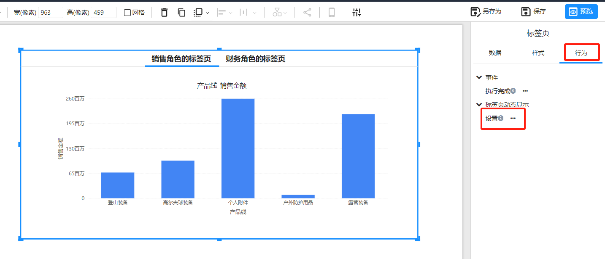
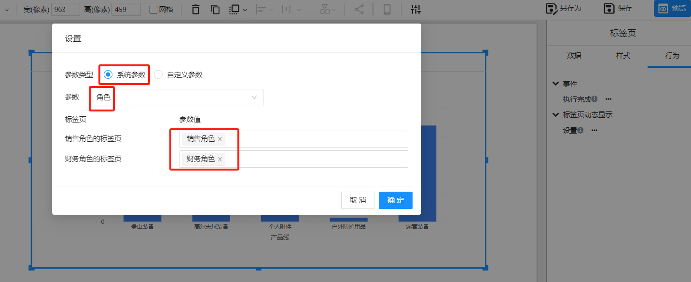
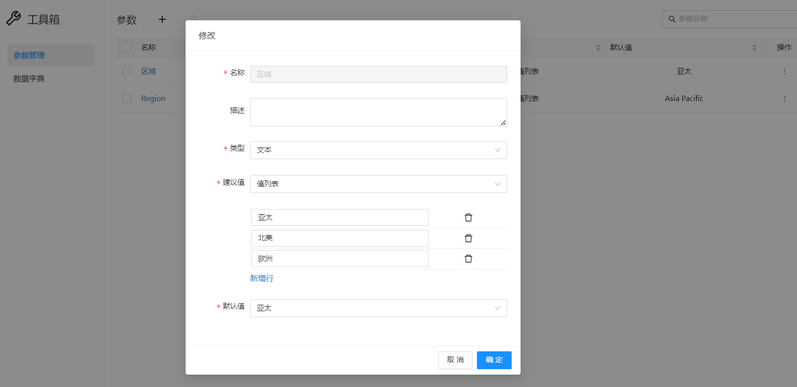
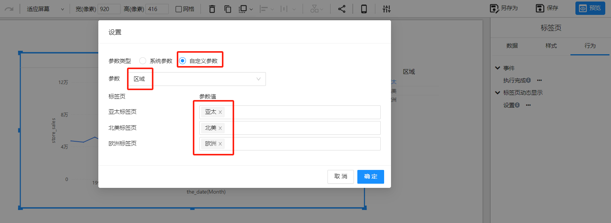
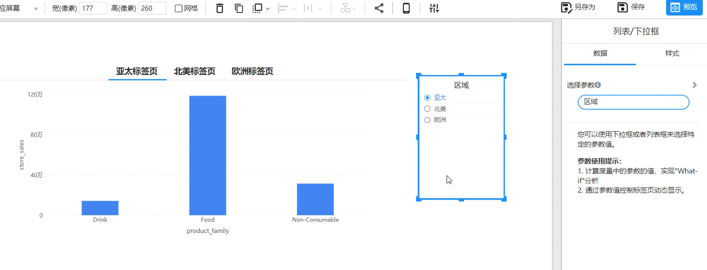
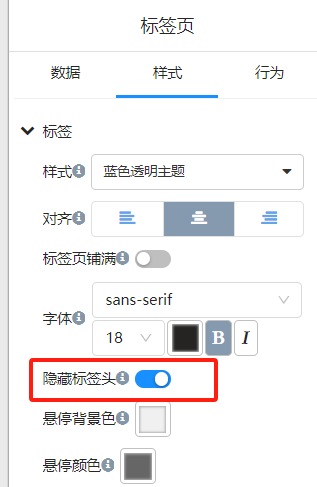
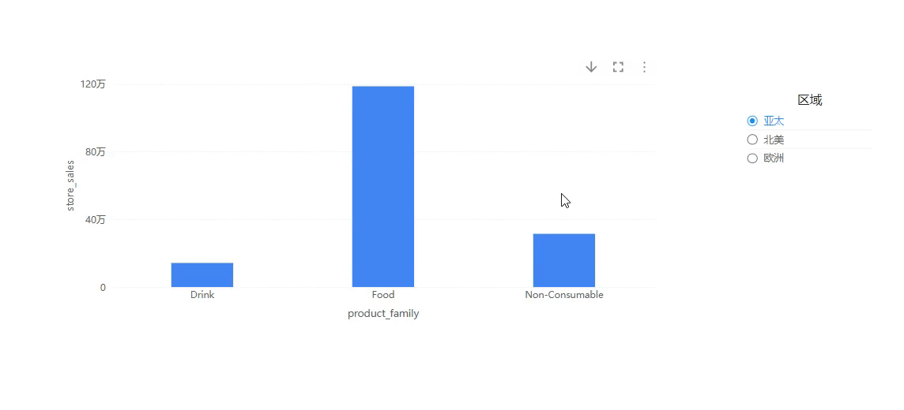

# 参数驱动标签页切换

**参数驱动标签页切换**允许根据系统参数或用户自定义参数动态控制标签页的显示。

## **参数类型**

1. **系统参数**

   - **基于用户和角色的可见性**：标签页可以根据用户的身份或角色来控制显示。例如，只有特定角色的用户才能看到某些标签页。

   **使用场景**：

   - 一个包含不同部门（如销售角色、财务角色）的仪表板，其中每个部门的标签页仅对该部门的用户可见。

2. **全局参数**

   - **用户自定义参数**：这些是由用户或管理员设置的参数，用于决定显示哪些标签页。根据用户的选择或特定条件，标签页的显示会动态变化。

   **使用场景**：

   - 用户可以选择一个参数（例如“区域”），然后控制显示对应的标签页，例如不同区域（如亚太、北美和欧洲）的标签页。

## **设置参数驱动标签页显示**

### 系统参数驱动：

- **定义用户角色**：在系统设置中定义用户角色。

- **分配角色到标签页**：根据角色配置哪些标签页应对每个角色可见。

  1. 选中标签页组件，在”**行为**“面板选择”**设置**“

     

  
  2. 选择”**角色**“系统参数，并将标签页对应的参数值中设置对应的角色。
  
     

### 全局参数驱动：

- **创建参数**：定义全局参数例如 **区域**

     

- **分配参数值到标签页**：根据参数值配置哪些标签页应对每个角色可见。

     

- **使用参数控制器改变参数值**

  
     

## **隐藏标签页的头**

在许多情况下，参数驱动的标签页切换可能需要隐藏标签页组件的头部。

隐藏标签页组件的头部，可以通过设置标签页的样式来实现，使用户只能通过参数控制来切换标签页，而不能手动切换标签页。

