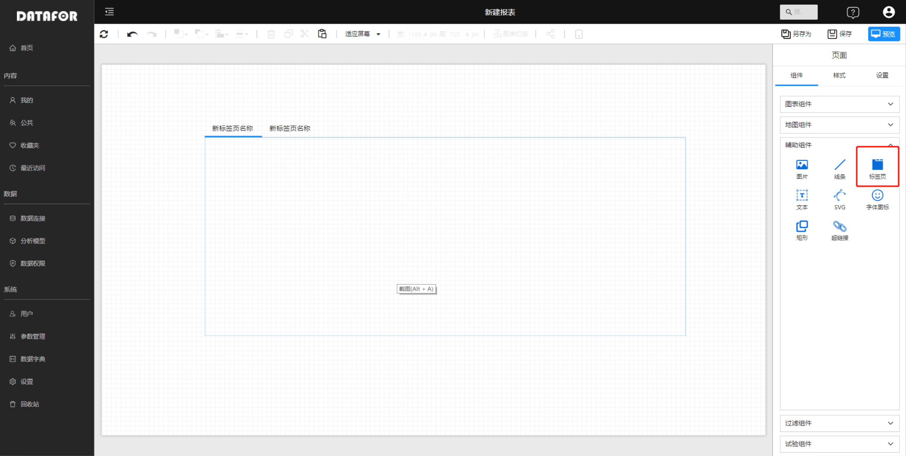
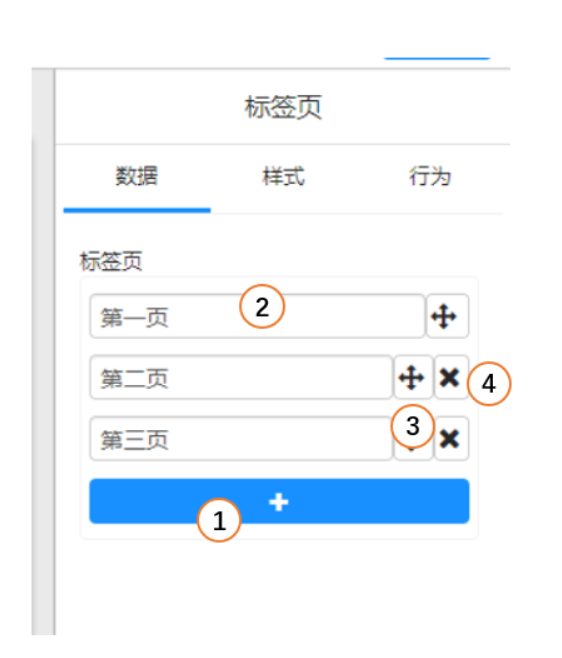
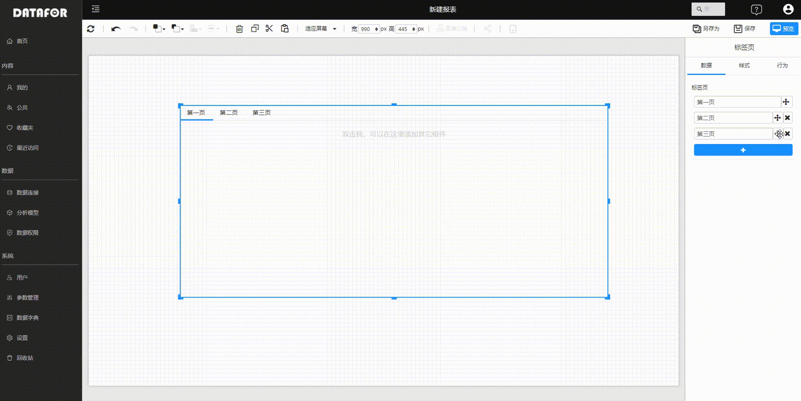
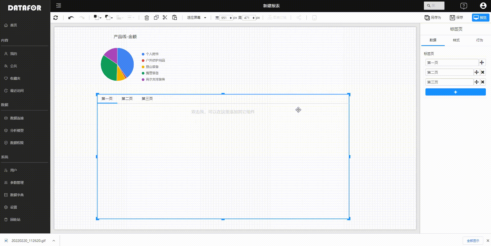
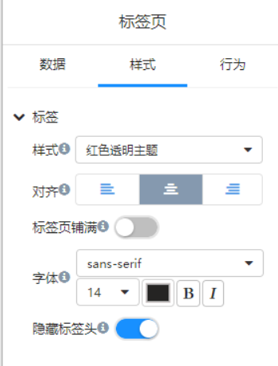

---
id: sjfxyksh-zzdbqy
title: 制作多标签页面
sidebar_position: 6
---
# 制作多标签页面

标签页是制作分析报表时常用到的功能。页面上可以添加多个标签页，每个标签页可以放置多个图表组件。

## 添加标签页组件

组件面板中选择“标签页”组件。

## 设置标签页和调整标签页顺序

选中画布上的标签页组件，右侧面板的“数据”面板上设置标签页个数和调整顺序。

   | 序号 | 功能           |
   | ---- | -------------- |
   | 1    | 增加标签页     |
   | 2    | 设置标签页名称 |
   | 3    | 移动标签页顺序 |
   | 4    | 删除标签页     |

## 在标签页中添加组件

双击标签页，进入编辑模式，将其它组件拖放或复制到到标签页中。

## 标签页样式调整

选中画布上的标签页组件，右侧面板的“样式”面板上设置标签页样式。

| 序号 | 样式     | 说明                                                         |
| ---- | -------- | ------------------------------------------------------------ |
| 1    | 样式     | 红色透明主题、蓝色透明主题、白色不透明主题                   |
| 2    | 对齐     | 标签页文字对齐方式                                           |
| 3    | 铺满     | 标签铺满整行                                                 |
| 4    | 字体     | 标签字体                                                     |
| 5    | 隐藏标签 | 页面预览时标签不显示，在用“参数”控制标签页显示和隐藏的情况下使用 |

