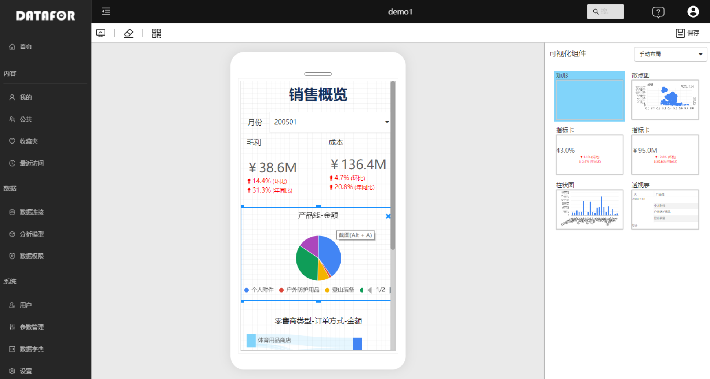
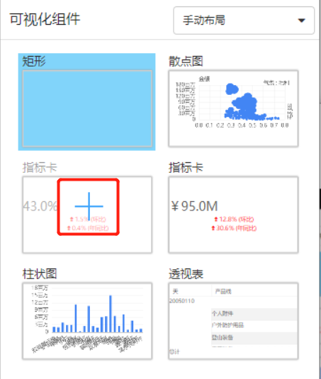
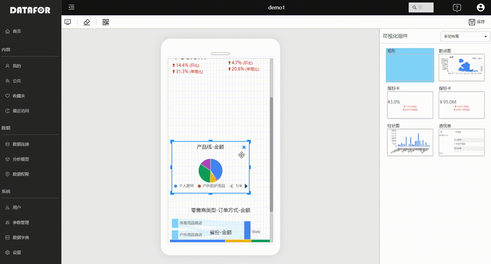
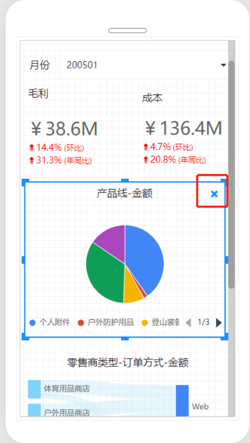
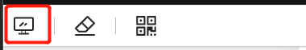

# 手机布局视图

在计算机桌面上设计的分析报表并不适用于手机端的阅读和交互。为此，DATAFOR提供了“手机端布局视图”功能，允许在同一报表页面中，使用不同的布局视图在手机和桌面上打开。

## 如何开启手机端布局视图

通过工具栏上的“手机布局”按钮，可以打开手机端布局视图。

页面从桌面布局视图切换到移动布局视图。

## 设置移动布局视图

### 添加组件

桌面布局上的所有元素在右侧的面板上列出，您可以点击组件上的“+”按钮，将组件添加到移动布局视图上。

在手机布局画布上，组件可以任意拖动位置和调整大小。

### 调整位置和大小

您可以重新排列和布局可视化元素和组件在手机布局画布上。

### 删除组件

- 从移动布局画布上删除组件，在画布上选中组件，点击右上角的“X”按钮，或按下Delete键。
- 删除画布中的所有组件，在工具栏上点击“橡皮擦”按钮。

从移动布局画布中删除组件只会将其从移动布局画布中删除，组件会重新回到“组件列表”中，可以再次添加到画布中，原始桌面布局报表不会受到影响。

## 移动布局视图和桌面布局视图切换

通过工具栏上的“桌面”图标可以切换页面到桌面布局视图。

## 移动布局视图特点

- 移动布局画布能够适应不同尺寸的手机屏幕宽度。
- 系统能够自动判断访问页面的设备类型，自动切换桌面和移动布局视图。
- 移动布局视图对页面弹出框和组件放大等进行了优化。