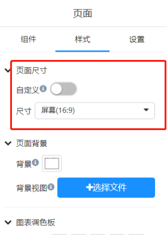
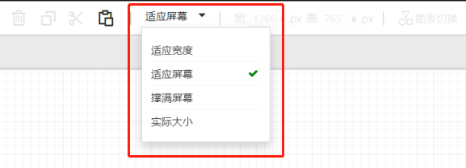
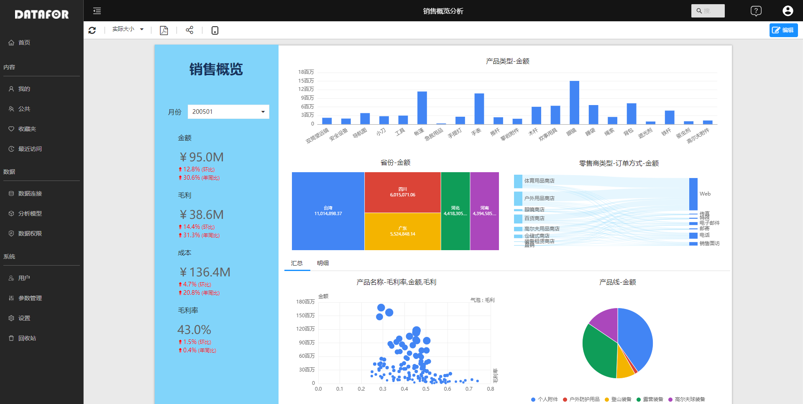
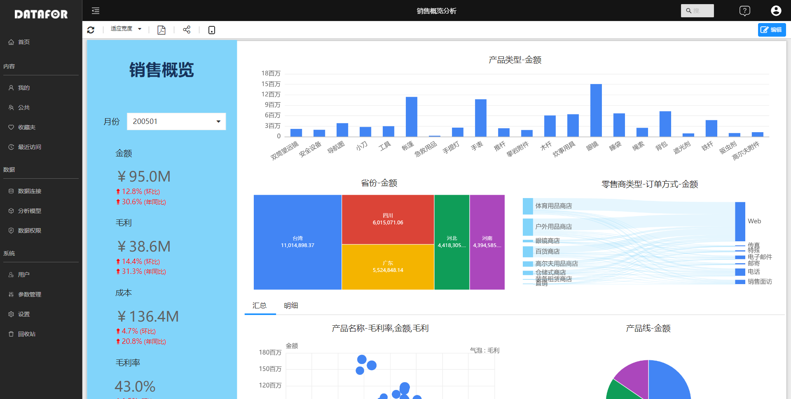
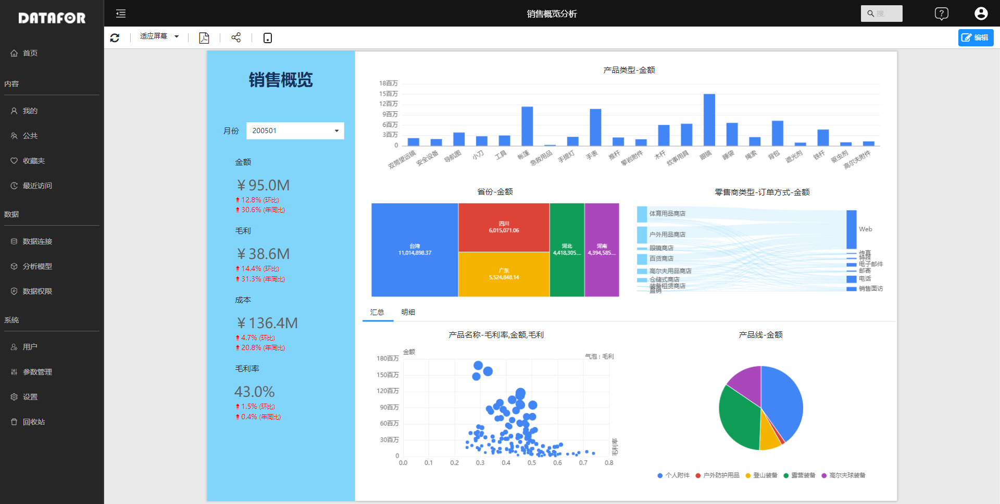

---
id: sjfxyksh-bbyddxhxsfs
title: 报表页的大小和视图
sidebar_position: 1
---

# 报表页的大小和视图

可以通过调整报表页大小和显示方式，使其适应您在不同大小和长宽比的屏幕上查看报表。

## 报表页大小设置

“页面大小”设置仅供报表开发者使用 。在编辑视图中打开报表， “页面大小”设置位于“可视化效果”窗格中，并控制报表画布的显示比例和实际大小（以像素为单位） ：

- 4:3 比例（1366pxX1024px）
- 16:9 比例（默认值）（1366pxX765px）
- 手机（320pxX568px）
- 平板（1024pxX768px）
- 自定义（以像素为单位的高度和宽度）

## 页面视图设置

通过工具条上“视图”菜单中的选项，可灵活地按所选的大小和宽度显示报表页面 。

 

- 假设你正在小型设备上查看报表，很难看清标题和图例。 可选择 “实际大小”，增加报表页的大小 。 使用滚动条在报表中移动。

  

- 还有一个选项是选择“适应宽度”，使报表适合屏幕宽度 。 由于只关乎宽度而未设置高度，因此可能仍需使用垂直滚动条。

  

  

- 如果不想要任何滚动条，但却希望充分利用屏幕尺寸，请选择“适应屏幕” 。

  

    

- 在将报表页面投影到大屏幕上供人们查看时，可以选择“撑满屏幕”。

