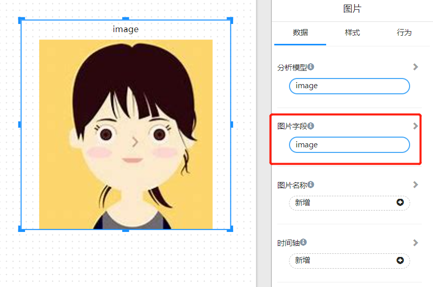

# 图片

图片组件用来显示图片的Base64编码或者图片的超链接。

## 什么是图片的Base64编码

图片的 base64 编码就是可以将一副图片数据编码成一串字符串，使用该字符串代替图像地址。

下面代码是一张图片的base64 编码：

```

```

## 什么是图片的超链接

超链接图片就是一个指向图片的超链接。

例如：https://datafor.com.cn/wp-content/uploads/2020/01/Datafor-logo-2.png

## 使用图片组件

您可以将图片的base64编码或者超链接存放到数据库，就可以通过Datafor的模型来引用并在图片组件中显示图片。

<div align="left"></div>