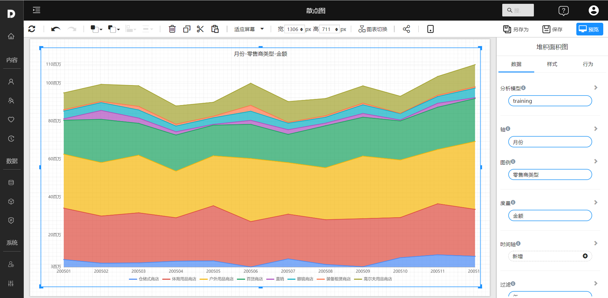

# 堆积面积图

堆积面积图（Stacked Area Chart）用于显示多组数据在不同时间段内的相对变化。这种图形将多组数据的值堆叠在一起，以创建一个整体的面积图。每组数据的值被绘制为一条折线，并与下一组数据的折线重叠，从而创建一个累积的效果。这样可以清晰地展示数据的整体构成，以及每组数据的相对贡献。堆积面积图通常使用X轴表示时间，Y轴表示值。它通常用于分析多组数据的相对量和总体的变化，例如某个行业的市场份额变化，或预算中的费用分配。

## 适用场景

- 分析市场份额变化：通过图形展示一个行业内多家公司的市场份额变化情况。
- 费用分配：用于展示预算中的费用分配情况。
- 资源使用：用于展示一个项目中多个资源的使用情况。
- 时间序列数据：用于展示一段时间内多种指标的变化情况。
- 分析多维数据：用于展示多维数据的关系。

## 组成

1. X轴：通常表示时间，用于显示数据的变化情况。
2. Y轴：表示数值，用于显示数据的大小。
3. 面积：由多个数据组合而成，每个数据组代表一种颜色，通过不同颜色堆叠显示多组数据的相对变化。

## 示例

 

## 设置

| 设置内容       | 参考文档 |
| -------------- | -------- |
| 设置背景和边框 |          |
| 设置图例       |          |
|                |          |
