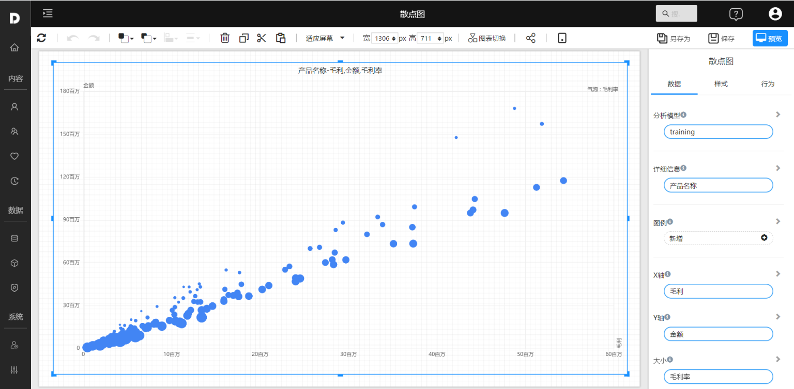
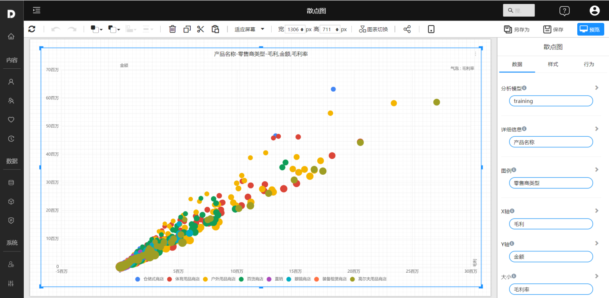

# 散点图

散点图用于展示两维数据之间的关系。它通常用横坐标和纵坐标表示两个变量，并以散点的形式展示数据点的位置。散点图可以用来观察数据中的趋势、关联、分布等信息。它是一种非常简单直观的图表，常用于研究、数据分析、数据挖掘等领域。

## 适用场景

- 观察两个变量之间的关系：散点图可以用于展示两个变量之间的相关性，例如是否存在线性关系、非线性关系等。
- 观察数据分布：散点图可以用于展示数据的分布情况，例如是否存在异常值、是否存在密集分布等。
- 研究因果关系：散点图可以用于研究两个变量之间的因果关系，例如两个变量的变化是否同时发生。
- 可视化数据趋势：散点图可以用于展示数据的趋势，例如数据是否呈上升趋势、下降趋势等。
- 可视化多维数据：散点图可以用于可视化多维数据，例如通过颜色、大小等因素可以反映不同的维度信息。

## 组成

1. X轴：水平轴代表绘制的一个变量。
2. Y轴：垂直轴代表另一个被绘制的变量。
3. 数据点：数据点代表两个变量的组合，它们通常以散点的形式在散点图上显示。
4. 趋势线：可以在散点图上添加趋势线（例如回归线），以显示数据的总体趋势。
5. 标签：X轴和Y轴可以使用描述性变量名称进行标记，以指示数据的含义。
6. 图例：可以在散点图上添加图例，以指示由颜色或形状等因素表示的不同组。

## 示例

图上的点表示产品，x轴表示毛利，y轴表示销售金额，点的大小表示表示毛利率。

通过图形上的点可以看到产品在各个指标轴上的分布情况，能够发现一些“离群点”。

 

通过颜色区分产品在不同零售商维度的各指标分布。

 

## 自定义形状

## 设置

| 设置内容       | 参考文档 |
| -------------- | -------- |
| 设置背景和边框 |          |
|                |          |
|                |          |

