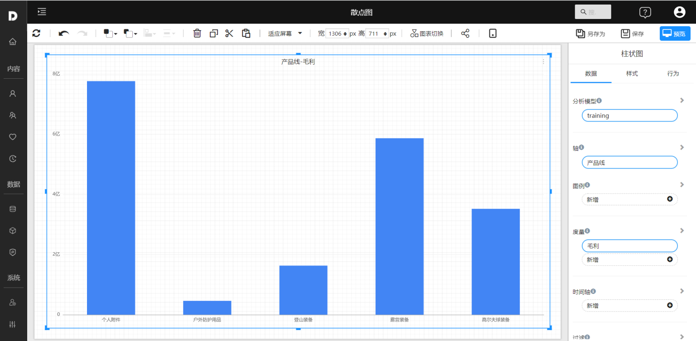
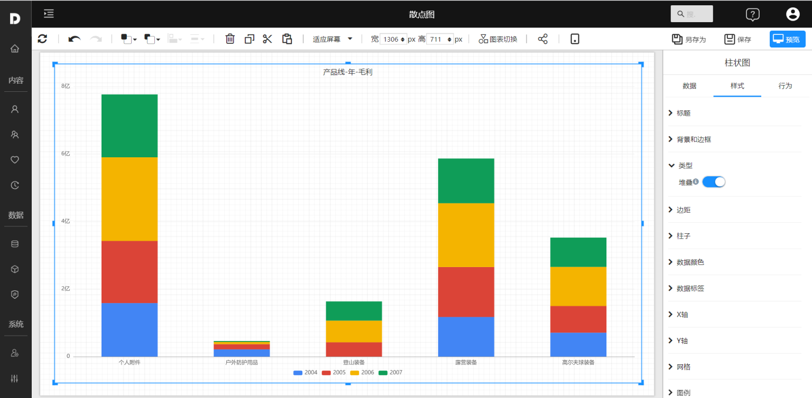

# 柱状图

柱状图（Bar Chart）是一种常用的数据可视化图表，通常用于表示一组数据中各项数值的大小关系。它通过将数据项以柱形的形式呈现，其长度与数值成正比，因此很容易比较各项数据的大小。柱状图通常横轴代表类别，纵轴代表数值。

柱状图可以用于表示多维数据，例如：在同一图表中显示多个类别的数据，使用不同颜色的柱形区分各类别；也可以在同一图表中显示多组数据，例如使用堆叠柱形图显示不同部分的数据。

柱状图的优点在于：简单易懂，容易比较各项数据的大小关系；不足在于：当数据项数量较多时，图表可能会显得拥挤，不便于阅读。

## 适用场景

- 表示频率分布：柱状图可以用于表示一组数据中各项数值的频率分布，例如显示每个年龄段的人数分布。

- 表示分组数据：柱状图可以用于表示分组数据，例如显示每个国家的生产总值。
- 表示趋势：柱状图可以用于表示数据的趋势，例如显示某公司的年销售额。
- 比较不同组别的数据：柱状图可以用于比较不同组别的数据，例如显示不同城市的人口数量。

## 示例

### 基础柱状图

基础柱状图，使用柱子显示类别之间的数值比较。

### 簇柱状图

簇状条形图适合分析对比组内各项数据，也可以比较各个类别的值。

### 堆叠柱状图

堆叠柱状图将每个柱子进行分割以显示相同类型下各个数据的大小情况。它可以形象得展示一个大分类包含的每个小分类的数据，以及各个小分类的占比，显示的是单个项目与整体之间的关系。

## 其它设置