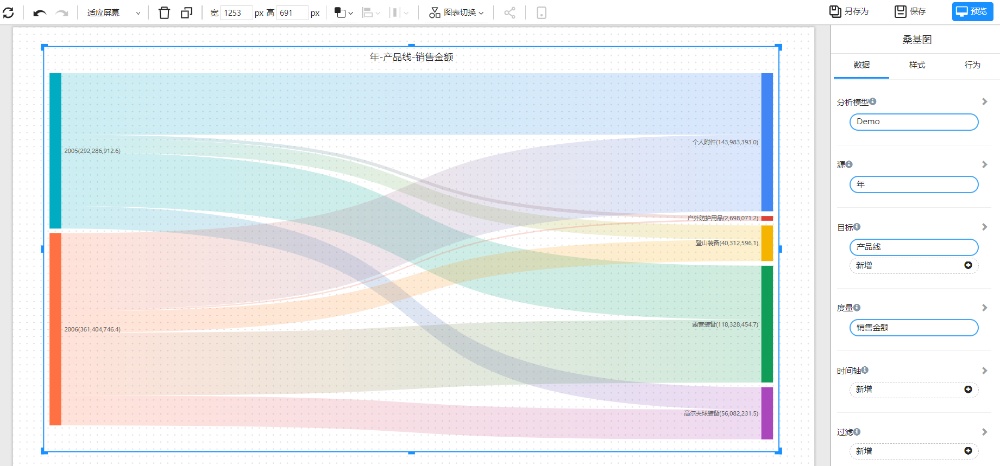
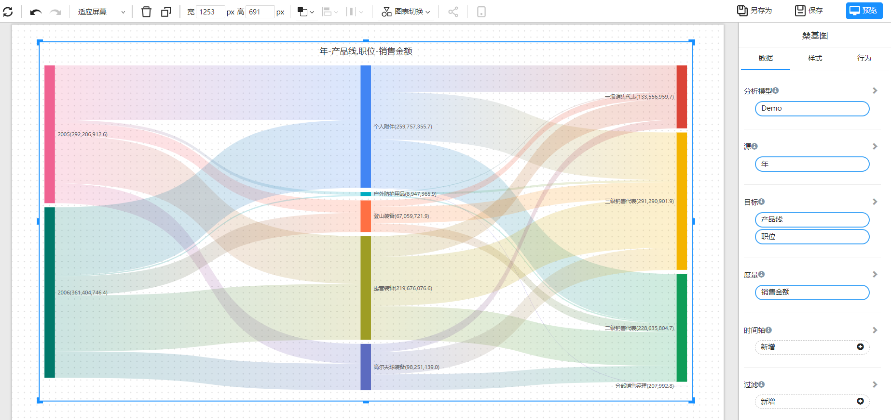

# 桑基图

桑基图（Sankey）是一种特殊的流量图，它用于显示从一个节点流向另一个节点的物质、能量或信息的流动。在桑基图中，每个节点是一个宽度不等的带，宽度代表流量的大小。带之间的连接线代表流动的方向，宽度代表流量的大小。桑基图通常用于显示能量流动、物质制造和消耗、预算分配等。

## 应用场景

- 能源流动分析：用于显示能源从生产到消耗的流动情况。
- 物质生产和消耗分析：用于显示物质从生产到消耗的流动情况，以及生产和消耗之间的关系。
- 预算分配分析：用于显示预算的分配情况，以及各部门之间的预算转移。
- 供应链分析：用于显示从原材料到产品的流动情况，以及各环节之间的关系。
- 流量分析：用于显示信息、物质或能量从一个地方流向另一个地方的流动情况。
- 财务分析：用于显示财务流动情况，以及资产和负债之间的关系。

总的来说，桑基图是一种非常适合用于显示流量情况的图形，特别是对于复杂的流量关系，桑基图可以帮助我们清晰地理解和分析。

## 构成

1. 节点：代表流量的起点和终点，通常是一个宽度不等的带。
2. 连接线：代表流量的流动方向，用于连接两个节点，连接线的宽度代表流量的大小。
3. 流量：代表物质、能量或信息的流动，通常以数量或比例的形式表示。
4. 文本标签：代表节点或流量的说明，用于说明流量的含义和数量。
5. 图例：用于说明流量的颜色和线条粗细等代表的含义，帮助读者更好地理解桑基图的信息。

## 示例

二个维度间的数据流向和大小

三个维度间的数据流向和大小

