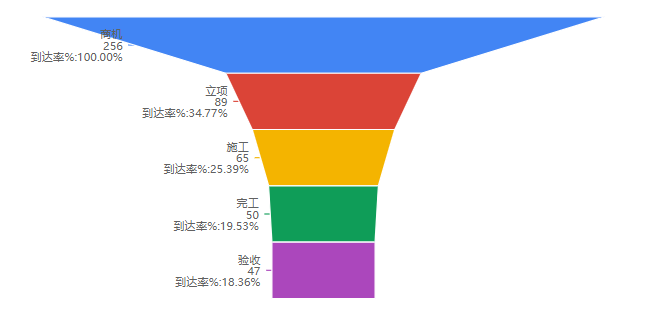
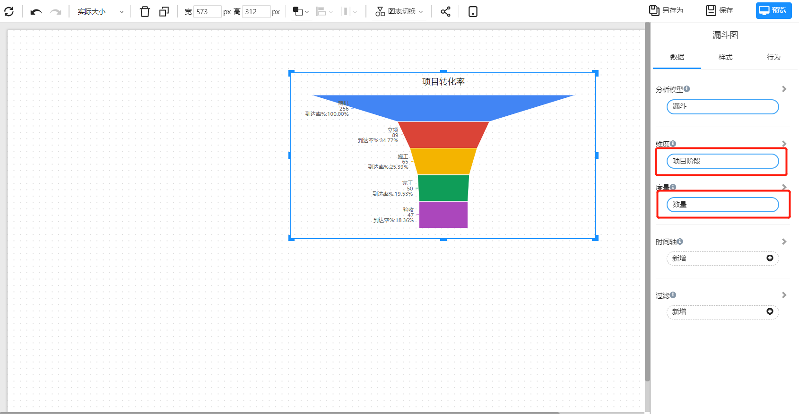
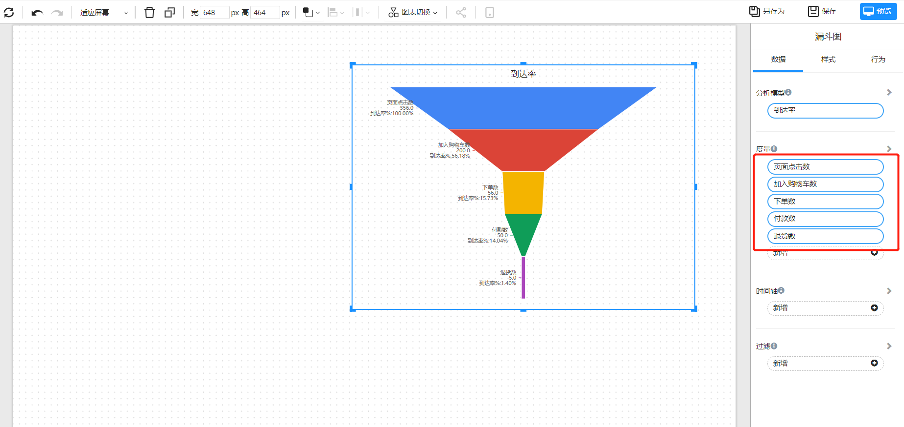

# 漏斗图

漏斗图是一种表示过程分为多个阶段的图形表示，展示了每个阶段的潜在客户或元素数量以及随着他们经过该过程而减少的数量。漏斗图通常用于可视化和分析销售或营销流程，例如客户从初始意识到最终购买的过程中的步骤。

## 适用场景

- 销售流程：跟踪销售流程中每个阶段的潜在客户数量，例如潜在客户生成、资格认证、提案、谈判和结束。
- 客户旅程：可视化和理解客户从初始了解到最终购买的步骤。
- 营销活动：通过显示生成的销售线数量、成为客户的销售线数量和两者之间的转化率，来跟踪营销活动的效果。
- 项目管理：表示项目中的阶段，并跟踪每个阶段的进展。
- 工作流程管理：表示工作流程中的阶段，并跟踪每个阶段的进展。
- 网络分析：跟踪用户行为，并理解用户在网站或移动应用中的旅程的步骤。

  

## 组成

1. 一个维度和一个度量，显示维度之间的转化率
2. 多个度量，显示度量之间的到达率

## 示例一

显示项目不同阶段的转化率

| 项目阶段 | 数量 |
| -------- | ---- |
| 商机     | 256  |
| 立项     | 89   |
| 施工     | 65   |
| 完工     | 50   |
| 验收     | 47   |

“项目阶段”作为维度，项目数量作为度量

  

## 示例二

指标之间的到达率

| 时间 | 点击数 | 加入购物车 | 下单数 | 付款数 | 退货数 |
| ---- | ------ | ---------- | ------ | ------ | ------ |
| 2005 | 356    | 200        | 56     | 50     | 5      |

将不同的指标按先后次序加到度量数据中，显示不同指标之间的到达率

  

