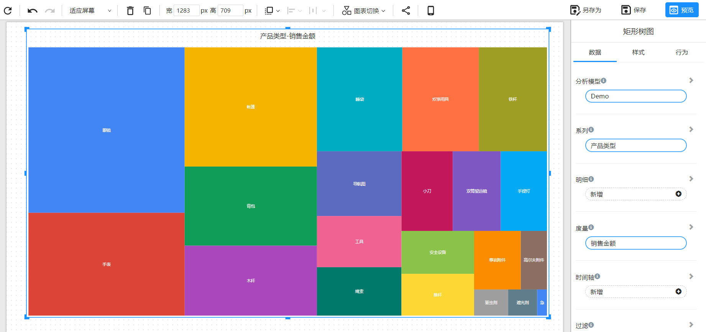
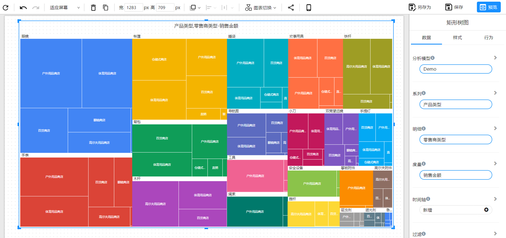

# 矩形树图

矩形树图可以展示层级结构或分类数据的关系。它由矩形和节点组成，矩形的大小表示数据的数量，节点表示分类或层级结构。

## 适用场景

- 对层级结构或分类数据进行可视化展示：矩形树图可以展示层级结构或分类数据的关系，可以直观地呈现数据间的层次结构。
- 对比不同维度的数据：矩形树图可以同时呈现多个维度的数据，通过颜色、边框、标签等方式表示不同的节点，从而对比不同维度的数据。
- 分析数据间的关系：矩形树图可以直观地展示数据间的关系，例如上下级关系、组成关系、比例关系等。

## 组成

1. 维度：矩形树图通过节点表示数据的分类或层级结构，每个节点都是一个维度，例如商品分类、地域等。
2. 指标：指标是矩形树图中用于表示数据数量的度量，通常是每个节点中的数据数量或者比率。指标可以通过矩形的大小来表示，矩形越大表示数据量越多。
3. 层次结构：矩形树图的节点之间通常存在层次结构，每个节点代表一层，层次结构由父节点和子节点构成，父节点表示该层的总数，子节点表示该层数据的细分。
4. 颜色：矩形树图中的颜色通常用于区分不同的节点和层次，通过颜色的不同来表示不同的类别或者数据量的大小。

## 示例

### 分类数据

### 层级数据

