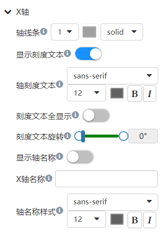
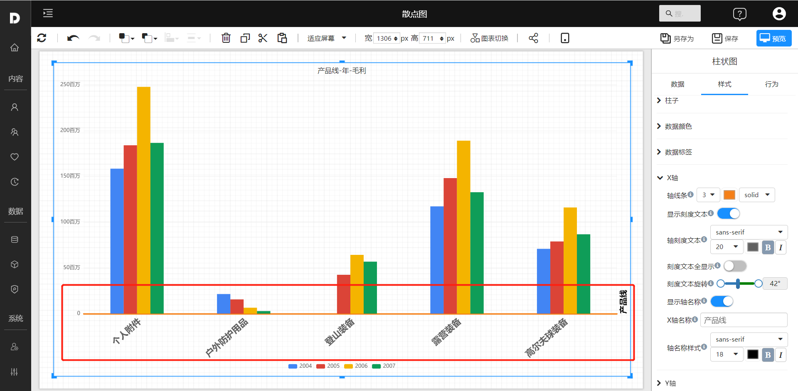
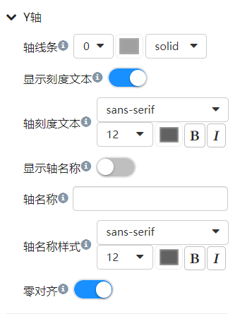
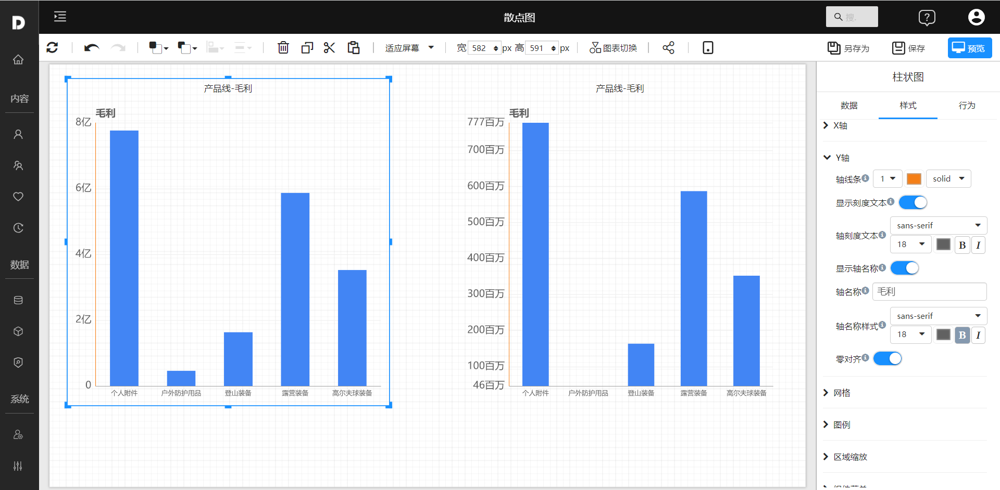

# 自定义X轴和Y轴

不是所有图表组件都有坐标轴，例如，饼图就没有坐标轴。有坐标轴的组件的X轴和Y轴的自定义选项也可能不是完全一样。这里我们以柱状图为例介绍一些常用选项。

## X轴

1. 展开X轴样式标签

 

2. 设置线条

   调整线条粗细、线条颜色、线条样式。

3. 设置刻度文本

   是否显示肯定文本，设置文本字体、颜色、是否粗体、是否斜体。
   当柱子间距太小，刻度文本显示位置不够时经常需要旋转刻度文本。

4. 设置名称

   轴名称显示在X轴的右侧。文本可以自定义输入。同时可以设置文本的字体、颜色等文本属性。

 

## Y轴

1. 展开Y轴样式标签

 

2. 设置线条

   调整线条粗细、线条颜色、线条样式。

3. 设置刻度文本

   是否显示肯定文本，设置文本字体、颜色、是否粗体、是否斜体。
   当柱子间距太小，刻度文本显示位置不够时经常需要旋转刻度文本。

4. 设置名称

   轴名称显示在X轴的右侧。文本可以自定义输入。同时可以设置文本的字体、颜色等文本属性。

5. 零对齐

   设置轴的范围是否以最小值/零开始。

 
