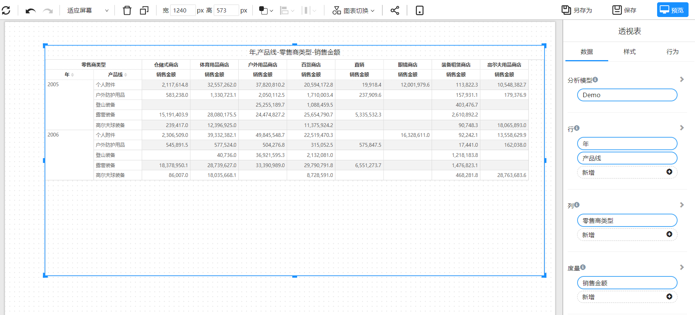
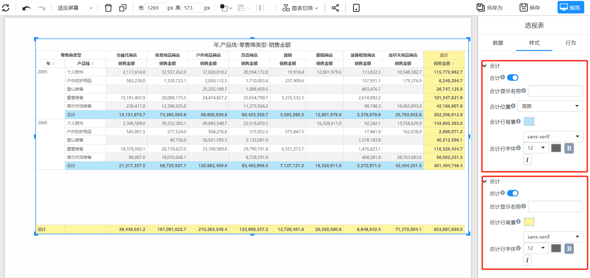

# 透视表

透视表帮助用户快速分析大量数据，通过不同的角度和维度查看数据，并对数据进行汇总和计算。

## 适用场景

- 汇总数据：透视表可以快速汇总大量数据，并且易于使用和理解。
- 分组和聚合数据：透视表可以按照多种方式分组和聚合数据，例如按部门、销售人员、日期等分组。
- 数据分析：透视表可以在数据中查找趋势、模式和异常值，并且可以动态地更改分组和聚合方式以查看数据的不同方面。

## 组成

1. 行标签：表示透视表中每一行的分类变量，如员工姓名、日期、地域等。

2. 列标签：表示透视表中每一列的分类变量，如部门、产品等。

3. 度量区：表示透视表中的数据记录，如、销售额、库存金额等。

4. 汇总：用于对数据进行汇总，如计算平均值、求和、最大值、最小值等。

   

## 制作透视表

1. **设置透视表数据**

   透视表由行、列、度量三个数据构成。

   

2. **合计和总计**

   透视表的行和列字段都可以设置合计汇总和总计汇总。

   样式面板中的”合计“和”总计“开关可以打开或关闭合计和总计行，并可以调整背景色、字体大小等样式属性。

   

3. **其它特性**

   - 行列排序
   - 下钻和过滤
