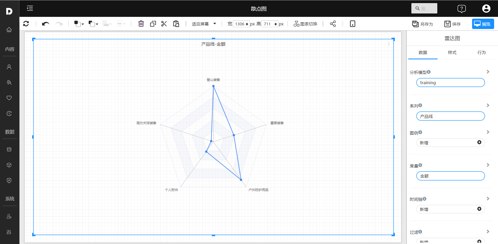
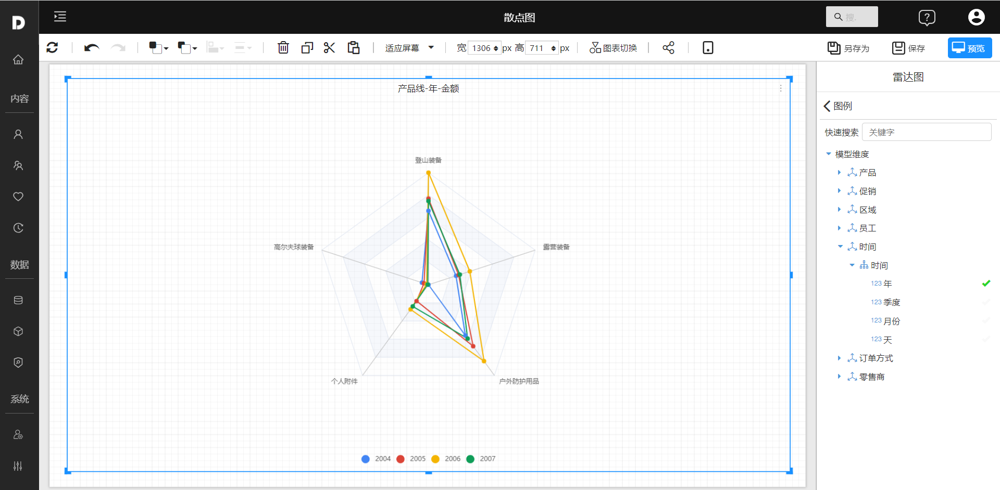
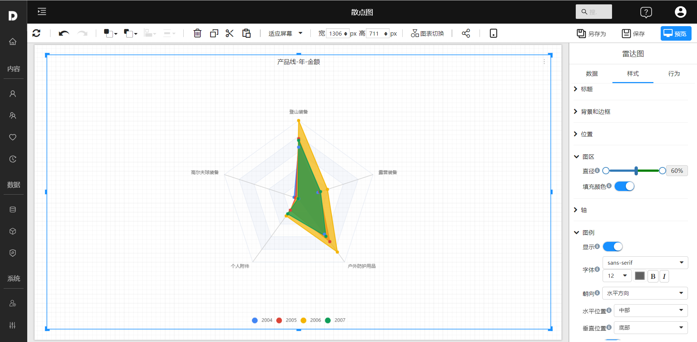

# 雷达图

雷达图是将3个或3个以上不同维度的数据，通过一定的公式，将不同维度的数据转化为统一度量后，绘制在同一个中心点出发轴上的图形。雷达图可以展示对象多个维度的数据，并将不同度量的维度数据转化成统一度量，直观地描述了单个对象的属性。

雷达图由多个维度、统一度量2个部分组成。

## 适用场景

- 雷达图适用于多维数据（四维以上），一般是用来表示某个数据字段的综合情况，数据点一般6个左右。

## 组成

1. 每一个 **维度** 的数据都分别对应一个 **坐标轴**，这些坐标轴具有相同的圆心，以相同的间距沿着径向排列，并且 **各个坐标轴的刻度相同**。
2. 连接各个坐标轴的网格线通常只作为辅助元素。
3. 将各个坐标轴上的 **数据点用线连接起来** 就形成了一个**多边形**。
4. 坐标轴、点、线、多边形共同组成了雷达图。

## 示例

### 多维对比－单雷达链

### 多组多维对比－多雷达链

通常表示由多个维度组成的能力衡量。

### 填充雷达图

