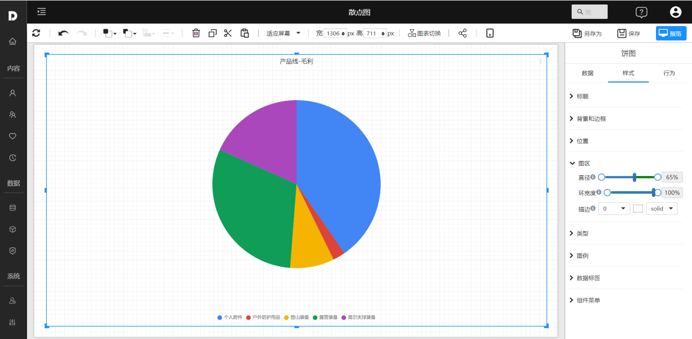
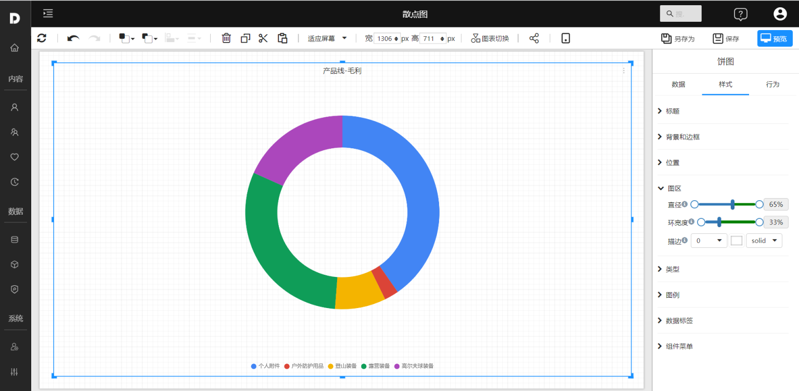
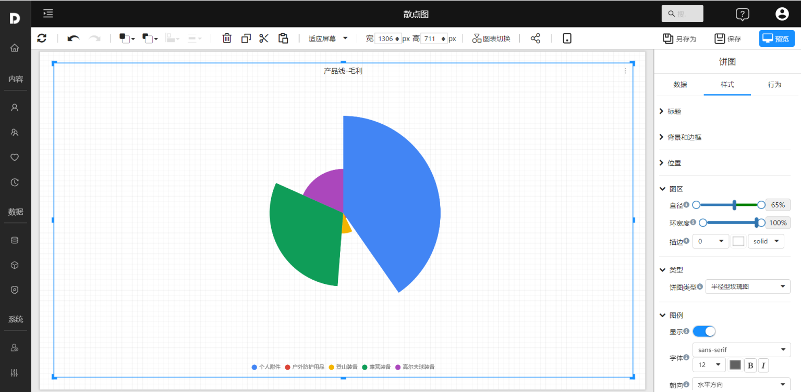
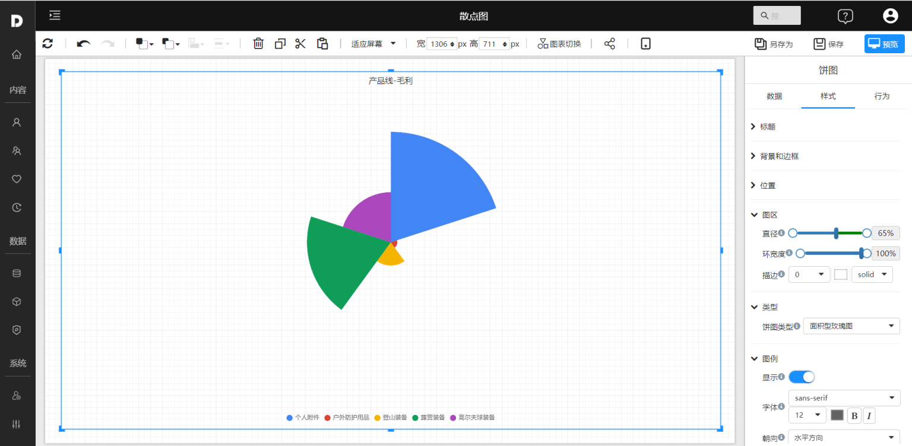

# 饼图

饼图表示不同分类的占比情况，通过弧度大小来对比各种分类。饼图通过将一个圆饼按照分类的占比划分成多个区块，整个圆饼代表数据的总量，每个区块（圆弧）表示该分类占总体的比例大小，所有区块（圆弧）的加和等于 100%。

## 适用场景

- 展示分类的占比情况
- 展示多个指标的占比情况

## 组成

1. 一个饼图由若干个 **扇区** 组成，每个扇区代表数据的一个 **组成部分**
2. 每个扇区的**弧长**（以及圆心角和**面积**）大小为其所表示的 **数量的比例**。
3. 这些扇区合在一起刚好是一个完全的圆形。

## 示例

### 饼图

### 环图

环图相对于饼图空间的利用率更高，比如我们可以使用它的空心区域显示文本信息。

### 半径形玫瑰图

通过半径的大小来对比数据。

### 面积形玫瑰图

通过面积的大小来对比数据。

## 其它设置

|      |      |
| ---- | ---- |
|      |      |
|      |      |
|      |      |

