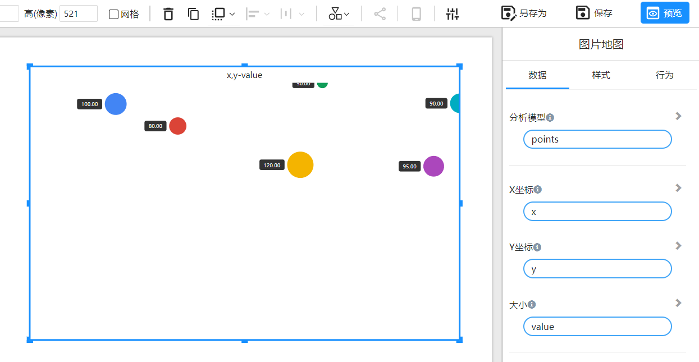

# 图片地图

## 什么是图片地图？

“图片地图”组件使用户能够在图片的特定像素位置添加标记，以便在图像的不同区域识别和展示关键信息。

## 如何确定标记位置的X坐标和Y坐标？

在图片地图中，坐标系统的原点位于图片的左下角（0, 0）。具体而言：

- **X坐标** 是标记点水平上距离原点的像素数。
- **Y坐标** 是标记点垂直上距离原点的像素数。

## 示例

### 示例数据

下表列出了6个标记的坐标和对应的值：

| Marker | X    | Y    | Value |
| ------ | ---- | ---- | ----- |
| A      | 337  | 645  | 100   |
| B      | 579  | 585  | 80    |
| C      | 1057 | 479  | 120   |
| D      | 1143 | 703  | 50    |
| E      | 1679 | 647  | 90    |
| F      | 1577 | 475  | 95    |

### 操作步骤

1. 选择图片地图组件

   

2. 在画布上确定组件的位置和大小

   

3. 配置组件数据

   

4. 选择图片背景

   

5. 根据像素位置自动适应标记

   

6. 设置标记图标

   为标记选择不同的图标

   

7. 配置标记颜色

   选择颜色字段，颜色可以基于数值或类别

   

