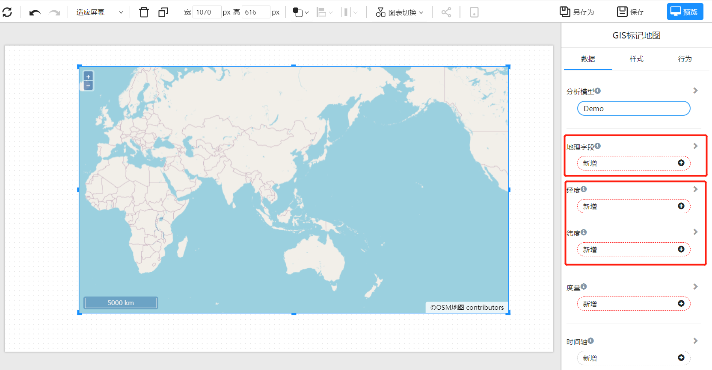
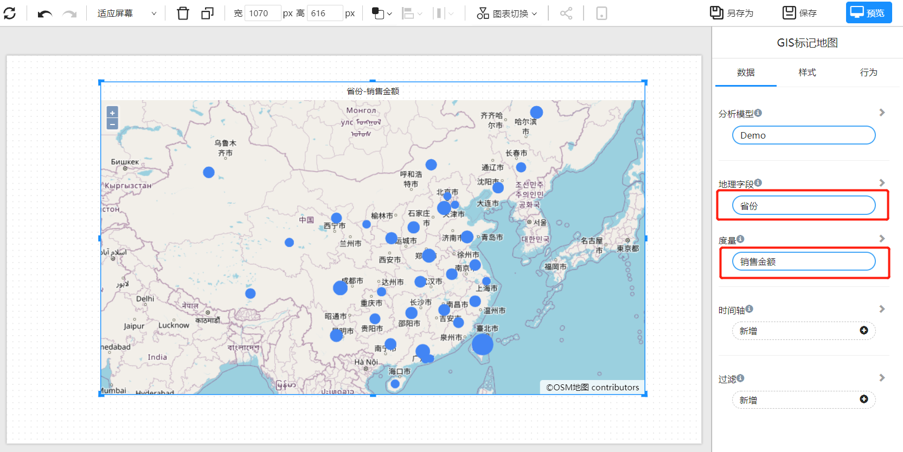
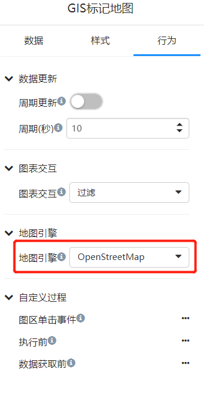

# GIS标记地图

GIS（地理信息系统）标记地图用于将数据可视化在地图上，以便用户更直观地了解数据分布和空间关系，同时提供更精确的分析和决策支持。GIS标记地图可以帮助用户更好地了解地理数据，包括位置、区域和地理特征，以及它们与其他数据的关系。

通过将数据和地图结合，用户可以快速发现数据的地理位置和空间趋势，以及更好地理解数据之间的相互作用和关系。此外，GIS标记地图还可以帮助用户发现数据的趋势和模式，以及在特定地点的变化情况。

在商业和政府领域，GIS标记地图被广泛用于可视化市场和客户分布、资源管理、城市规划、环境监测和自然灾害响应等方面。

## 何时使用GIS地图

- 对比地理区域的指标差异。
- 获取地理位置的分布的概况。

## 创建GIS标记地图

绑定”地理字段“，例如城市名称、或任何地理名称。或者经纬度信息到”经度“、”纬度“ 数据块。
如果所使用的数据集包含经度和维度字段，请使用经度和维度。经纬度信息更精确定位位置，并且省去了后台地理位置转码（GeoCoding）过程。

例如，将”省份“字段绑定”地理字段“，选择”销售金额“度量字段。

## 更改地图引擎

默认地图引擎是Opent Street Map。Datafor支持的GIS系统包括：高德地图、百度地图、Open Street Map、Google Map等。
您可以在地图配置文件里配置和修改地图引擎。

