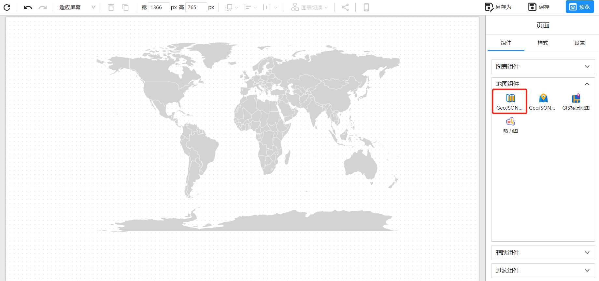
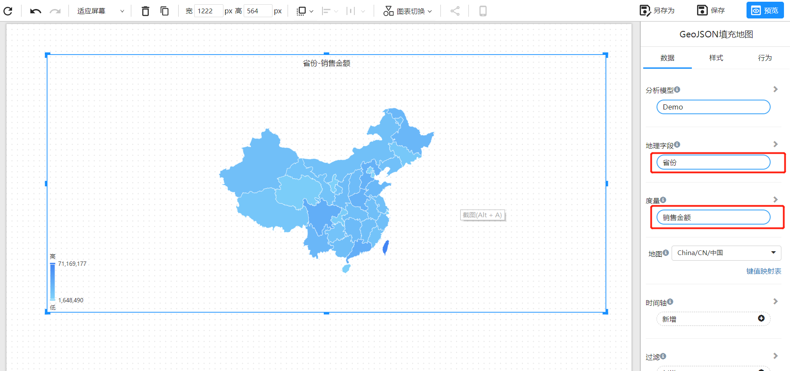

# GeoJSON填充地图

GeoJSON填充地图将GeoJSON格式的地图数据与数据集结合，填充颜色不同的区域以显示不同区域的数据情况。GeoJSON是一种开放标准格式，可用于表示地理空间数据。使用GeoJSON filled map可以更准确地显示地图数据，例如国家、省份、市区等行政区划，同时可以更直观地展示数据。

## 创建地图

1. 在 Datafor 中创建一个新的报表，并在报表的设计模式下添加一个 GeoJSON Filled Map组件。这将在报表设计器的画布区域添加一个空白的地图。

   

2. 选择地图数据

   在数据面板选择所需要的地图JSON数据。

   

3. 添加地理数据字段

   

4. 自定义地图样式 
   你可以按照自己的喜好自定义地图的样式，包括背景色、边框线、标签等。

## FAQ

1. 我的地区名称如何对应GeoJSON的地区名称？

   在”键值映射表“中维护地图地区名称和数据的映射关系。

   

2. 可以自定义GeoJSON地图吗？

   您可以联系Datafor为您定制GeoJSON地图。联系邮箱：marketing@datafor.com.cn

