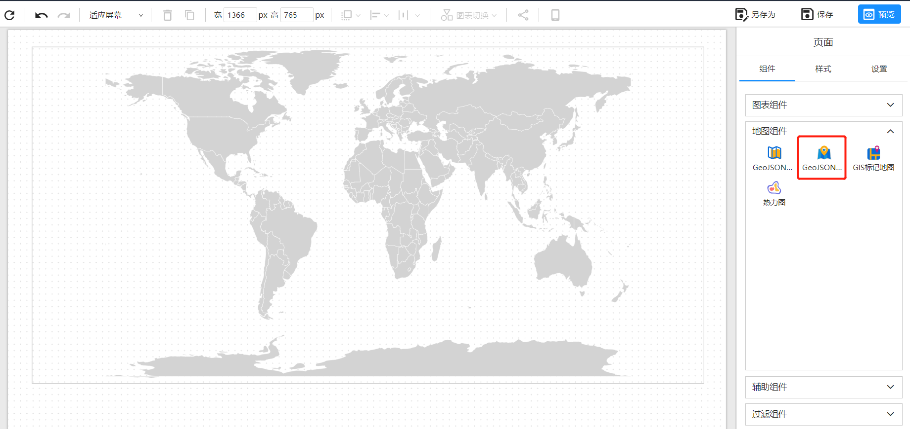
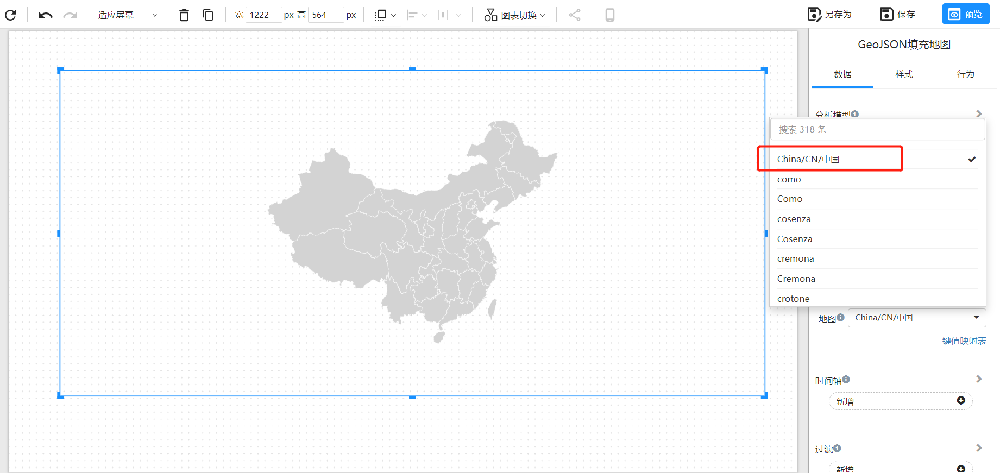
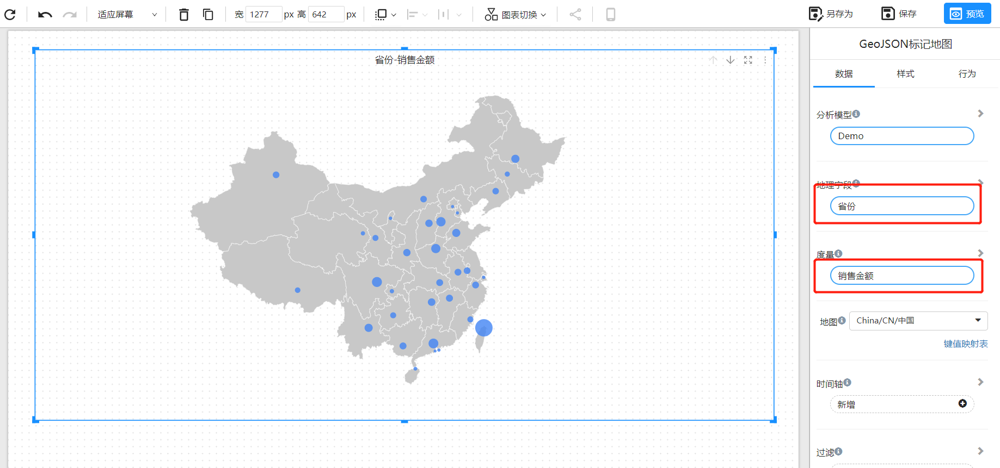
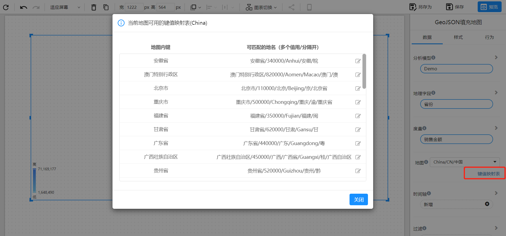

# GeoJSON标记地图

GeoJSON标记地图是一种将地理位置信息编码为GeoJSON格式的数据标记出来的地图。GeoJSON标记地图可以帮助用户在地图上更直观地展示地理位置信息，例如标记不同的地点、路径和地区等。

## 创建地图

1. 在 Datafor 中创建一个新的报表，并在报表的设计模式下添加一个 GeoJSON标记地图组件。这将在报表设计器的画布区域添加一个空白的地图。

   

   

2. 选择地图数据

   在数据面板选择所需要的地图JSON数据。

   

3. 添加地理数据字段

   

   

4. 自定义地图样式 
   你可以按照自己的喜好自定义地图的样式，包括背景色、边框线、标签等。

## FAQ

1. 我的地区名称如何对应GeoJSON的地区名称？

   在”键值映射表“中维护地图地区名称和数据的映射关系。

   

2. 可以自定义GeoJSON地图吗？

   您可以联系Datafor为您定制GeoJSON地图。联系邮箱：marketing@datafor.com.cn

