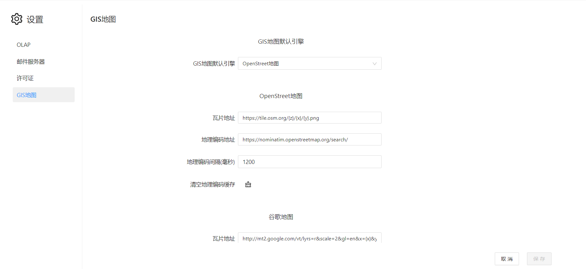

# GIS地图设置

Datafor的GIS地图组件支持“高德地图”、“Open street map”、“Google”地图。在使用这些GIS地图服务时需要设置不同GIS地图服务提供商所提供的瓦片地址、地理编码API，API Key。

## 设置项目

- ### 瓦片地址

GIS地图的瓦片地址是由一系列数字和字符组成的URL地址，其中包含了地图显示区域的坐标信息、地图缩放级别、地图类型等参数，以便在Web上动态加载地图瓦片。

**OpenStreetMap**的瓦片地址格式为：

```
https://a.tile.openstreetmap.org/{z}/{x}/{y}.png
```

其中，{z}表示缩放级别，{x}和{y}表示瓦片在该级别下的坐标。

**Google**地图的瓦片地址格式为：

```
http://mt2.google.com/vt/lyrs=r&scale=2&gl=en&x={x}&y={y}&z={z}
```

其中，{z}表示缩放级别，{x}和{y}表示瓦片在该级别下的坐标，{style}表示地图样式。

**高德**地图的瓦片地址格式为：

```
http://wprd04.is.autonavi.com/appmaptile?lang=zh_cn&size=1&scl=2&style=7&ltype=7&x={x}&y={y}&z={z}
```

其中，{s}表示瓦片服务器的编号，{style}表示地图样式，{x}和{y}表示瓦片在该级别下的坐标，{z}表示缩放级别。

- ### 地理编码API

GIS地图的地理编码地址是将地理位置的描述信息（如地址、街道、城市、省份等）转换为地理坐标的过程。

在GIS地图中，地理编码地址是通过调用地理编码服务提供商的API接口来实现的。地理编码服务提供商会根据输入的地址信息，从其大量的地图数据中查找与之匹配的地理位置，并返回对应的经纬度坐标，使其可以在地图上进行显示或其他操作。

**OpenStreetMap**的地理编码API是Nominatim。

正向地理编码查询（将地址信息转换成坐标）：

```
https://nominatim.openstreetmap.org/search/
```

**Google** 地图的地理编码API是一个付费API，需要用户创建一个Google Cloud账户并开通API服务。

```
https://maps.googleapis.com/maps/api/geocode/json
```

高德地图的正向地理编码查询（将地址信息转换成坐标）：

```
https://restapi.amap.com/v3/geocode/geo
```

- ### API key

GIS地图的API key是一种API密钥，用于访问给定的GIS服务。它是一个唯一的标识符，可以通过在应用程序中包含它来允许开发者访问和使用GIS地图服务。使用API密钥可以确保只有经过授权的用户才能访问地图服务，从而保护数据的安全性和完整性。

申请GIS地图的API key的具体步骤可能因不同的GIS服务提供商而有所不同，但通常需要按照以下步骤操作：

1. 选择一个GIS服务提供商，例如Google Maps、Baidu Maps、高德地图、Mapbox等。
2. 注册一个账号并登录到该服务提供商的开发者中心或API管理页面。
3. 创建一个新的项目或应用程序，并选择使用地图API。
4. 生成API key，并将其添加到Datafor的GIS地图配置中。

## 设置

在Datafor的"设置"中进入“GIS地图”配置界面。

目前Datafor支持OpenStreetMap、Google地图、高德地图的配置。



<!--Datafo服务器会缓存页面查询到的地理编码（地理坐标信息），你也可以在设置界面通过点击”清空地理编码缓存“ 按钮清除缓存的地理坐标信息。-->
