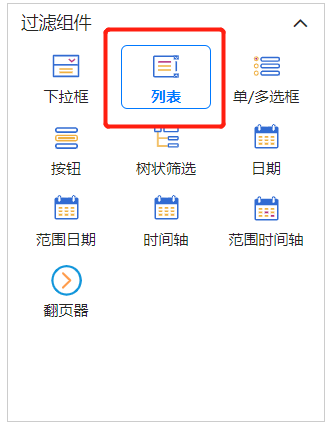
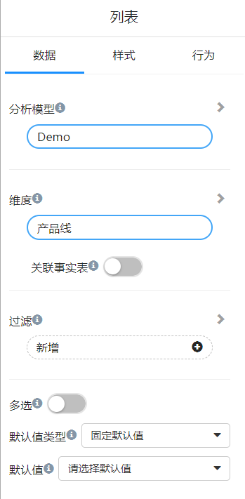
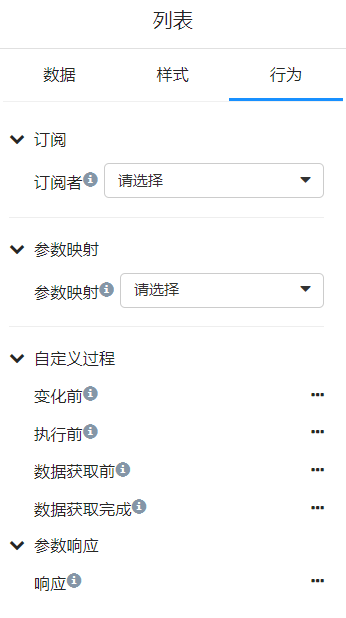

# 列表框

列表框（ListBox）**用于提供一组条目**（ 数据项 ），用户可以用 鼠标 选择其中一个或者多个条目，但是不能直接编辑列表框的数据。

<div align="left"></div>

## 设置数据

列表框可以显示维度或层次中的一个字段。

<div align="left"></div>

**关联事实表**：维度表和实时表关联。打开此开关，如果实时表中没有维度相关的记录，在列表框中不会出现维度数据。
并且，组件的过滤也受“关联实时表”开关影响。当打开此开关，可以用模型的任何维度或事实表上的字段进行过滤改列表框字段。

**多选**：列表框中的项目允许多选。

**默认值类型**：固定默认值和相对默认值。固定默认值是从列表中选择一个或多个固定的项目作为默认选中项目。相对默认值：第一项，最后一项。

## 设置行为

<div align="left"></div>

**订阅者**：建立列表框组件和页面中的其它组件的“过滤”关系。此列表框的选中值都会作为“过滤”影响的订阅组件。

**参数**：列表选中值赋值给相关参数。

**自定义过程**：组件的不同渲染阶段嵌入执行JavaScript代码。

以自定义过程”执行前“为例，当我们需要对组件渲染效果进行调整时，可以在这个自定义过程里进行干预。例如

```js
function shouldExecute(require, options){
	options.value = options.value?.slice(0, 3) || [];
	return true;
}
```

这段逻辑，将导致列表组件总是只显示列表数据的前3条。


