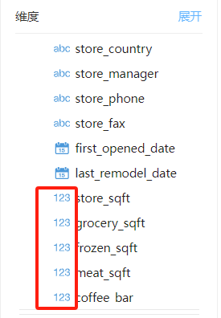
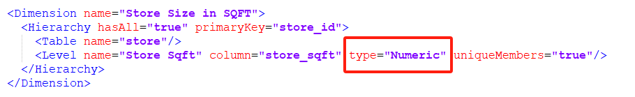
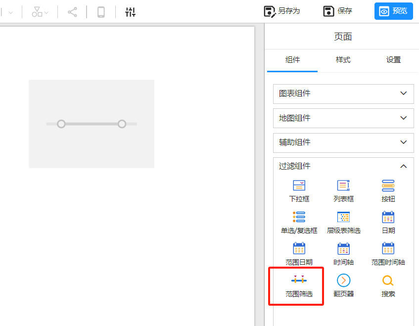
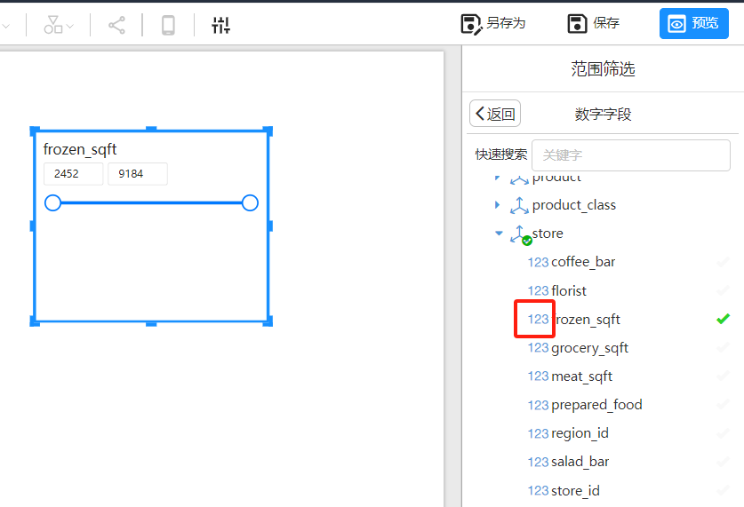

# 数字范围筛选器

数字范围筛选器用来筛选分析模型的维度上的数字类型字段。

## 数字类型维度字段

只有数字类型的维度字段才能被用在数字范围筛选器上。

### **Datafor分析模型**

Datafor创建分析模型时会自动检测数据表的字段类型，并将分析模型的维度字段设置成 “数字类型”。

### **Pentaho Mondrian 3 schema**

Pentaho的schema文件中，type为“Numeric” 的字段。

##  如何添加数字范围筛选器？

以下步骤将指导用户如何在 Datafor 报表中添加并配置数字范围筛选器：

1. **选择数字范围筛选器**

2. **选择“数字类型”字段**

   > [!NOTE]
   >
   > 当数字类型筛选器选择字段时，模型只会显示 “数字类型” 字段

   

## 使用数字切片器

### 调整数值范围

1. 在报表视图中，用户可以看到一个包含两个滑块的切片器，表示数值的最小值和最大值。
2. 用户可以通过拖动滑块来调整筛选范围。例如，从100到500。
3. 跟其它筛选组件一样，切片器将自动更新报表中订阅了此筛选组件的其它图表组件，以仅显示符合选择范围的数据。

### 输入具体数值

1. 用户也可以直接在切片器旁边的文本框中输入具体的最小值和最大值。
2. 输入完毕后，按下回车键，切片器将根据输入的数值更新筛选范围。

## 总结

通过数字范围筛选器，用户可以更灵活地筛选数值数据，快速聚焦于特定数值范围内的数据段。
