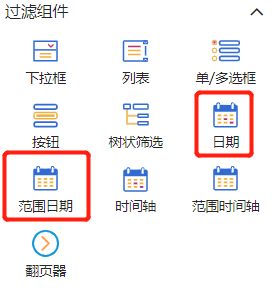
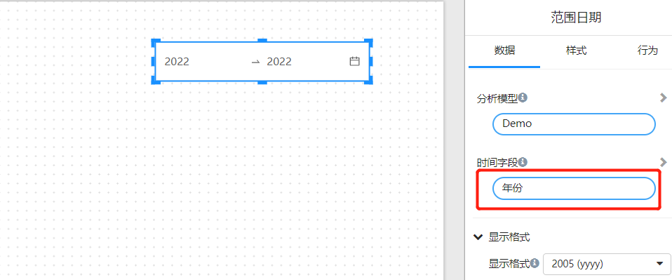
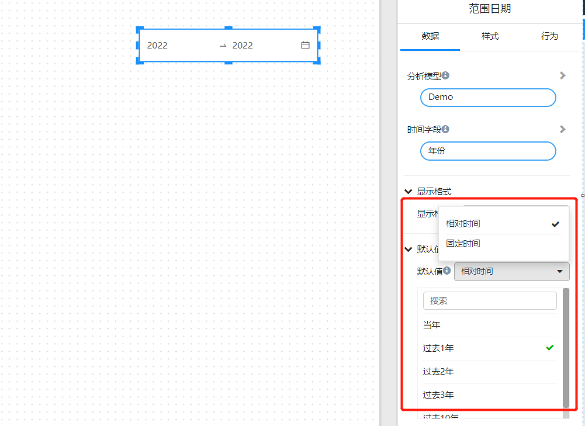
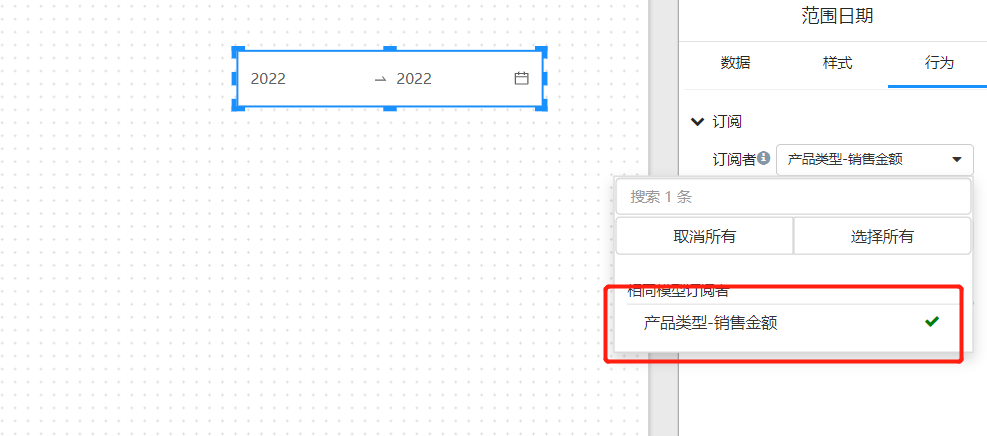
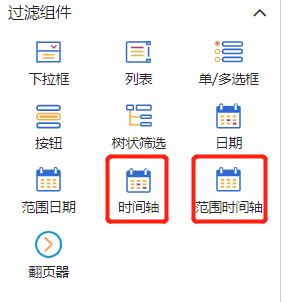
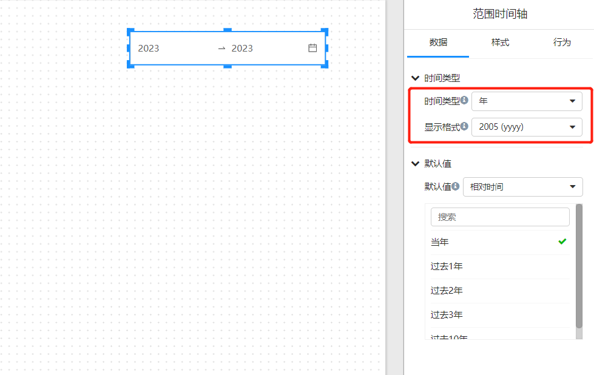
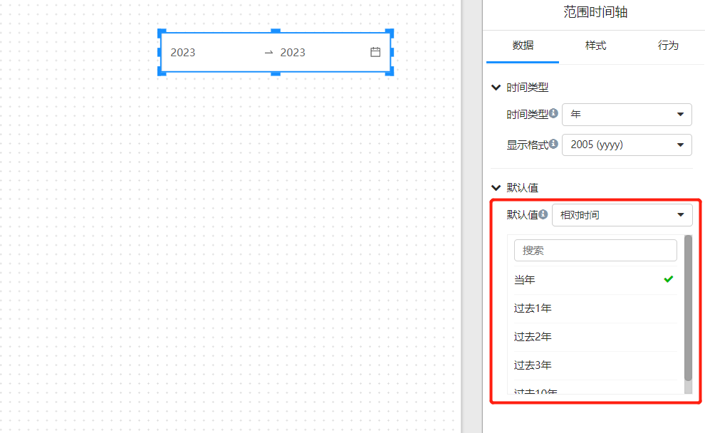
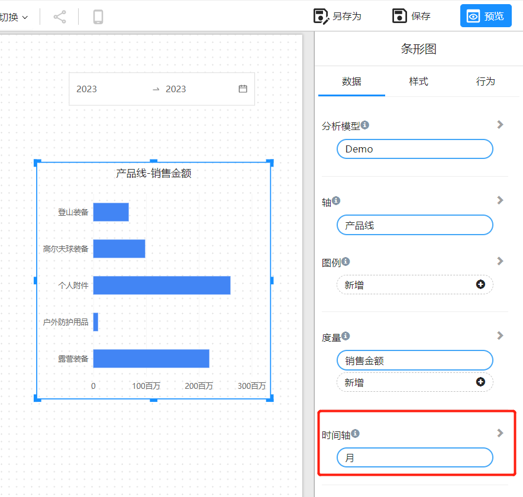
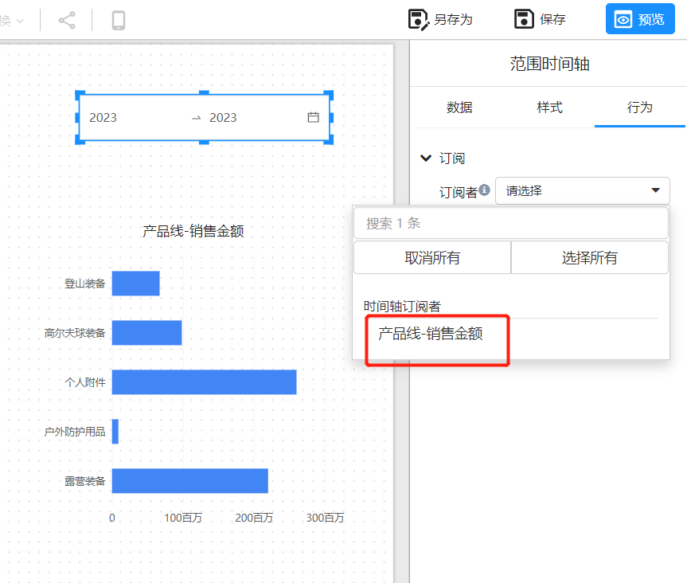

# 时间筛选

Datafor的时间筛选组件有2组：

绑定日期字段的时间筛选：

- 范围日期：筛选日期范围
- 日期：筛选单个日期

绑定时间轴字段的时间筛选：

- 范围时间轴：筛选时间轴范围
- 时间轴：筛选时间轴单个日期

## 绑定日期字段的时间筛选

绑定日期字段的时间筛选通过“订阅”关系，将时间筛选值传递给”订阅者“的模型的时间字段进行时间筛选。

选择分析模型中的时间字段

设置时间默认值。
时间默认值可以设置固定时间段，也可以设置成”相对时间“。

选择”订阅者“

注：Datafor会自动检测页面中用到的分析模型是否有此时间字段，决定组件是否出现在订阅列表中。

## 绑定时间轴字段的时间筛选

绑定时间轴字段的时间筛选通过”订阅“关系，将时间筛选值传递给”订阅者“的”时间轴“字段进行时间筛选。

设置时间轴时间类型和显示格式

设置时间默认值。
时间默认值可以设置固定时间段，也可以设置成”相对时间“。

选择”订阅者“

与”时间轴“组件配套使用的图表组件必须设置”时间轴“字段。

设置了”时间轴“字段的组件，并且设置的时间轴字段的粒度比时间轴筛选组件选择的时间类型更明细（比如筛选组件选择”年“，图表组件的时间轴字段是”年“、”季度“、”月“、”天），组件会出现在”订阅者“列表中。

